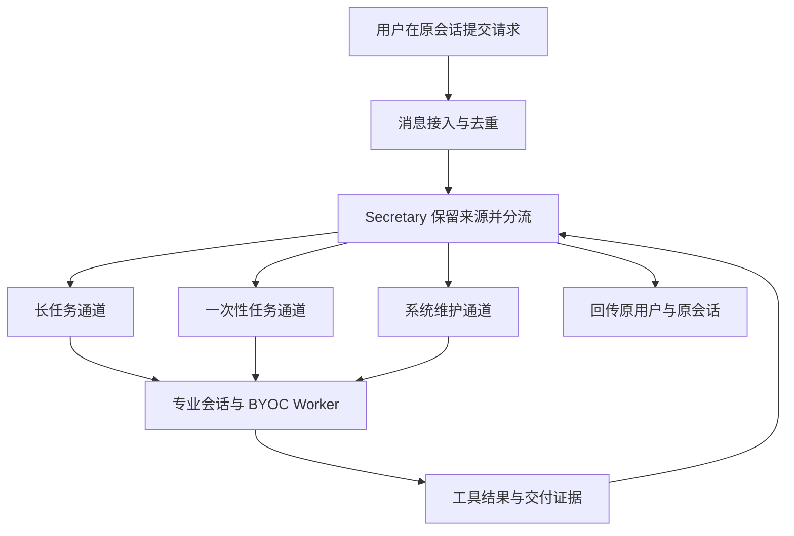

## 场景与成果

研发群里的一句“帮我处理发布冲突”，背后可能需要读取代码、定位冲突、修改文件、等待构建，再检查环境。若只把这些步骤放在一段聊天里，用户很难知道任务是否仍在执行，也难以区分“模型说完成了”和“工具已经验证通过”。

残风的交付机器人案例将钉钉作为任务入口，通过 QCA 路由到独立的专业会话，由企业网络内的 BYOC Worker 执行研发工具，最后把结果与证据送回最初的会话。

原始案例材料展示了一次发布冲突处理：机器人识别冲突、处理代码、完成构建与部署验证，再回传环境地址。这里整理其架构与操作流程，省略内部项目名、地址和会话截图；没有独立重跑该生产任务。后文的字段示例与验收步骤是复用建议，并非原系统的公开 API。

### 一次任务应该交付什么

| 用户关心的问题 | 对应交付物 |
|---|---|
| 到底改了什么？ | 变更范围与代码差异 |
| 有没有验证？ | 构建或测试结果，以及对应执行标识 |
| 现在处于什么状态？ | 当前阶段、等待原因或失败原因 |
| 去哪里验收？ | 获授权访问的结果地址或产物 |

这些内容共同组成交付结果。仅有一段总结，无法证明代码修改、构建和环境验证都已经发生。

## 实现思路

### 入口、路由和执行各自承担一件事

原材料区分了消息接入层 AM、秘书角色 Secretary 和专业 Agent。AM 负责接收与发送消息；Secretary 保留来源、选择通道和回答进度；专业 Agent 才承担代码、评审或诊断任务。



分流依据是最终交付物，而不只是某个关键词。比如“看一下这个变更”可能意味着代码评审，也可能意味着修复并交付，路由前需要明确任务目标。

| 通道 | 原材料中的用途 | 设计重点 |
|---|---|---|
| 长任务 | 需求实现、缺陷修复、跨轮次研发交付 | 协调者持续持有目标，组织分析、开发与评审 |
| 一次性任务 | Review、冲突处理、诊断、构建或发布操作 | 任务范围明确，完成后汇聚结果 |
| 系统维护 | 规范、角色、Skill 与运行时同步 | 将机器人自身的维护与业务任务分开 |

### 让来源上下文贯穿任务

任务在后台运行后，原来的聊天窗口不应成为唯一状态容器。原案例用 Source Context 保留会话、发送人、原话和去重键，结果回传时再找到最初的来源。

下面是可用于自建适配层的最小记录示意，字段名与值均为示例：

```json
{
  "task_id": "task-demo-001",
  "source": {
    "conversation_id": "demo-conversation",
    "sender_id": "demo-user",
    "message_id": "demo-message-001"
  },
  "goal": "处理测试仓库冲突并验证构建",
  "route": "one-shot",
  "status": "running",
  "evidence": []
}
```

建议在接收消息时生成稳定去重键，避免重复投递创建多个任务。进度查询读取任务记录；回传结果也使用同一任务与来源关联，防止并发执行时串到其他群聊。

### 以冲突处理为例，逐步推进验收

1. **明确目标**：记录目标仓库、分支、允许的修改范围，以及本次是否包含发布动作。
2. **读取事实**：检查冲突和当前代码状态，保存本次执行所依据的版本。
3. **执行修改**：在任务工作区处理代码；涉及业务语义且信息不足的冲突应请求澄清。
4. **等待验证**：触发构建或测试后，依据执行标识查询结果，不能把“已启动”当作“已通过”。
5. **汇聚证据**：整理变更、验证结果和未解决事项；部署只有在本次获得授权时才进入执行范围。
6. **原路回传**：结果绑定原用户和原会话。失败也返回具体阶段、错误原因与可继续的下一步。

这组步骤将原材料的交付过程转成可复用的验收流程。工具返回值决定阶段状态，Agent 的总结负责解释这些事实。

### BYOC 承担工具执行，任务状态独立保存

原材料采用常驻 Mac mini 的 BYOC Worker 访问企业 Git、构建系统与环境，QCA 管理 Agent、Session、路由与事件。这种分工让工具在能够访问目标资源的环境里执行。

BYOC 的部署位置本身不能证明所有数据都不外传。实际接入时，需要核对发送给模型的上下文、工具输出和日志内容，并按组织要求处理凭证与访问范围。

对于等待构建、Worker 暂时离线或回传失败，建议分别保存任务状态与消息投递状态：执行成功但通知失败时，应重试通知，不应重新修改代码或重复发布。

## 复用建议

### 从一个任务类型开始

先用测试仓库实现“接收请求 → 创建独立任务 → 运行构建 → 回传结果”。确认基础链路可靠后，再接入代码修改与多个专业角色。这样能分别检查消息接入、任务状态和工具执行，避免同时排查所有环节。

### 用故障场景检查闭环

| 检查场景 | 预期行为 |
|---|---|
| 同一消息重复投递 | 返回已有任务，避免重复执行 |
| 用户在执行期间询问进度 | 返回工具支持的当前阶段 |
| 构建失败 | 标记失败并保留执行标识，不回报成功 |
| Worker 中途重启 | 从持久状态判断继续、重试或等待人工处理 |
| 结果发送失败 | 单独重试通知，不重复业务操作 |
| 两个会话同时提交任务 | 任务隔离，结果准确回到各自来源 |

可复用的核心是明确职责、独立任务状态和证据回传。先让一个任务完整、可核对地交付，再增加通道和自动化范围，才有条件把聊天入口发展成可靠的研发助手。
