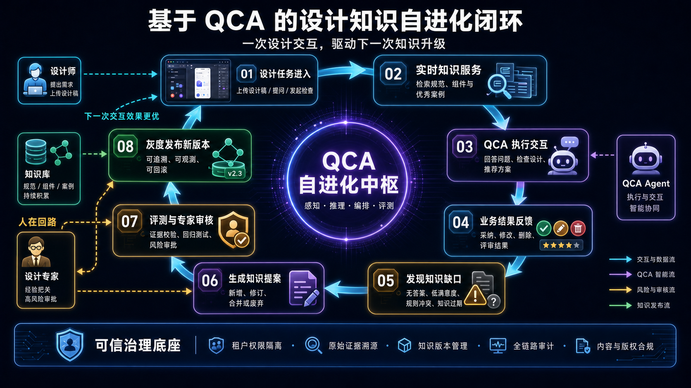

## 场景与成果

设计知识库很容易积累文档，却不容易知道哪些知识真的有用。一次组件推荐被设计师修改，一条规范检查被专家推翻，这些信息通常留在项目沟通中，下一次问答仍然检索原来的内容。

原 showcase 的设计知识自进化方案把这些业务结果接回知识维护过程：先完成设计服务，再识别知识缺口、生成提案、评测审核、灰度发布。这里的“自进化”是受控的知识版本更新，不是 Agent 在收到一次反馈后自行改写全局规范。

原 showcase 方案图，非产品运行截图。上半部分是本次任务的服务过程，下半部分是知识维护过程，两者通过反馈证据连接。

## 实现思路

### 服务链与知识链为什么需要分开

服务链要及时回答当前问题，知识链要决定规则是否适用于更多人。把两者绑成一次同步操作，会使用户等待审核；完全断开，又会让有价值的反馈丢失。

可以在任务交付时记录所用知识版本及业务反馈，让知识提案在后续流程中处理。当前任务仍使用已发布版本，候选规则不会因为被生成就影响所有用户。

### 原方案中的八个阶段

| 阶段 | 具体产物 | 下一步需要的依据 |
|---|---|---|
| 设计任务进入 | 问题、设计稿、项目上下文 | 任务范围与可访问材料 |
| 实时知识服务 | 规范、组件和案例引用 | 当前有效版本 |
| 执行设计交互 | 检查意见或方案推荐 | 建议关联的规则与位置 |
| 业务结果反馈 | 采纳、修改、追问和评审结果 | 原建议与实际结果的对应关系 |
| 发现知识缺口 | 冲突、过期、缺失或低质量信号 | 可追溯的任务证据 |
| 生成知识提案 | 修改内容、理由、适用范围 | 支持样例与影响范围 |
| 评测与专家审核 | 对比结果和审核决定 | 风险与反例 |
| 灰度发布 | 有范围的新版本 | 成功指标及回滚条件 |

原方案让 Agent 承担执行和提炼，专家负责高影响决策，知识库既提供当前材料，也接收获准的新版本。品牌规范、设计系统或版权相关规则不能只用采纳率决定是否发布。

### 评测要同时看修复与回归

| 测试设计 | 原规则 | 候选规则应有的表现 |
|---|---|---|
| 当前活动页 | 产生不适用建议 | 识别活动例外 |
| 普通常规页 | 原建议有效 | 保持原检查行为 |
| 未标明场景的页面 | 上下文不足 | 补问，不自动套用例外 |
| 其他项目的页面 | 不在提案范围 | 不受本次变更影响 |

候选规则改善了活动页，却让常规页漏检，就不应直接扩大范围。灰度发布也需要检查真正的业务结果：建议是否被合理采用、专家是否发现新问题，而不只是点击数上涨。

### 回滚应该改变知识版本，不删除历史

若新版本效果下降，恢复上一版的适用配置，并保留本次提案、评测和灰度结果。删除失败提案会丢掉重要反例，下一轮可能再生成同样的修改。历史记录还能解释为什么两个时间点的相同问题得到不同建议。

## 复用建议

先选一类高频且能看到最终结果的任务，例如按钮规范检查。将规则引用、设计师修改和专家最终决定关联到同一任务，再考虑自动提炼。没有这条对应关系，反馈只能成为零散意见，无法支撑知识升级。

第一轮验收不要求“自动升级了多少条知识”。更有价值的是检查：提案能否追溯原任务，局部偏好是否保持局部，反例能否阻止错误发布，以及回滚后原场景是否恢复。通过这些检查，再扩展到组件推荐和更广泛的设计知识。
