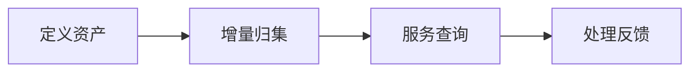

## 场景与成果

接口说明、代码知识和协作经验分散在不同位置时，找到一份文档并不代表找到了当前适用的答案。数字化资产案例围绕归集、检索和反馈维护同一套知识。

将研发资料的增量归集、标准化访问和使用反馈连接起来，形成持续维护的组织知识资产。

本文根据蓝屿提供的 showcase 资料整理。流程图与分工表用于解释案例中的方法；后面的具体示例是复用建议，不作为生产运行的实测结论。

## 实现思路

### 一次任务如何流经产品

案例将代码知识、协作产物和研发经验作为共同的知识输入。消费过程产生的纠错与补充反馈，反过来帮助更新资产。



每个环节都需要把自己的输入与结果交给下一步。后续步骤据此继续工作，用户也能沿着这条链查看结果从哪里产生、在哪一步需要确认。

### 角色分工与权威事实

| 组成部分 | 在案例中的职责 |
|---|---|
| 归集层 | 来源、版本和增量变化 |
| 知识服务 | 按适用范围检索与引用 |
| 维护流程 | 修订提案与发布记录 |

资产系统要同时处理“能否找到”和“是否适用”。来源、版本与适用范围应跟随每次检索，不能只保存在后台目录。

### 沿着一个具体任务展开

把测试项目的接口说明、变更记录和常见问题整理为可检索资产，并用一次实际查询暴露过期信息。

1. **定义资产**：为文档建立稳定标识、所属项目、版本、来源和访问范围。
2. **增量归集**：根据内容摘要识别新增和变化，只更新受影响的索引单元。
3. **服务查询**：先应用访问范围再检索，答案引用匹配的版本和具体材料。
4. **处理反馈**：将错误引用和缺失知识变成修订提案，审核后发布新版本。

这条流程的交付物需要保留过程中使用的依据。某一步缺少数据或执行失败时，应让状态继续可见，避免后续环节把它当作已经完成的结果。

### 让结果可以被核对

下面用一组合成数据说明预期交付。它是应用侧的说明样例，不是 QCA API 请求，也不是生产记录。

```json
{
  "input": {
    "query": "current API",
    "assets": [
      {
        "id": "a",
        "version": 1,
        "state": "superseded"
      },
      {
        "id": "a",
        "version": 2,
        "state": "current"
      }
    ]
  },
  "expected": {
    "selected_version": 2,
    "citation": "a@2"
  }
}
```

检索命中率相同也不能随机选版本。若用户明确询问历史版本，才允许切换并清楚标记时间适用范围。

## 复用建议

落地时可以先复现上面的一个任务，用已知输入核对交付结果，再补齐下面这些失败或歧义场景。通过后再扩大任务范围。

| 失败或歧义场景 | 需要保留的行为 |
|---|---|
| 用户无权读取某资产 | 检索结果和答案均不包含该材料。 |
| 文档已被新版本替代 | 优先当前版本，必要时解释变更。 |
| 用户反馈未经验证 | 形成提案而非直接覆盖知识。 |