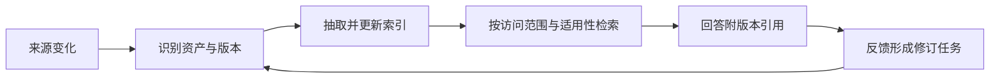
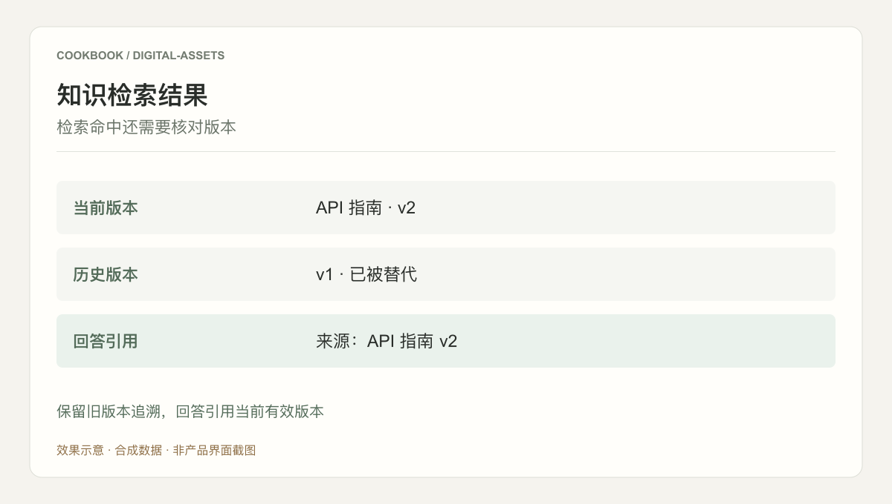

## 场景与成果

团队的接口说明、排障经验、项目复盘和常见问题通常分散在不同位置。把它们全部放进搜索框，只解决了“可能找得到”；业务人员还要判断文档是否过期、属于哪个项目、能否用于当前问题。

数字资产案例将归集、检索和使用反馈组织为持续维护的知识流程。现有 showcase 素材没有开放索引实现或线上评测，因此本文聚焦一个可复现的问题：同一接口存在两个版本时，如何让回答引用当前材料，同时保留旧版追溯能力。下文数据和结果为参考设计。

## 实现思路

### 从文件变成资产，需要补充哪些信息

文件名并不是稳定的身份，同一个文档可能改名、移动或导出为另一种格式。资产记录应把逻辑身份与具体版本分开，再记录来源、适用范围和维护责任。这样“API 使用说明 v2”能够明确替代 v1，而不是作为另一个互不相干的搜索结果。

| 信息 | 示例 | 解决的问题 |
|---|---|---|
| 资产身份 | demo-api-guide | 文档移动后仍可引用 |
| 版本与状态 | v2，当前；v1，已替代 | 区分有效内容与历史材料 |
| 适用范围 | 测试项目、接口版本 B | 避免跨项目误用 |
| 来源位置 | 原文及对应段落 | 回答能回到证据 |
| 维护责任 | 文档维护角色 | 错误反馈有人处理 |

### 增量归集不是每次重建整个知识库

输入发生变化时，先判断是内容变化、元数据变化还是访问范围变化。内容变化可能需要重新抽取与索引；只改标题不一定要重新解析全部文本；权限收回则需要及时影响检索，而不能等到下次全量重建。

以下流程展示一个参考维护顺序，重点在版本和检索之间保留适用性检查。

### 两个版本的检索演练

准备两份测试材料：v1 写“使用参数 mode”，v2 写“参数改为 strategy”，并明确 v2 替代 v1。让旧文档包含更多与提问相同的关键词，再提问“当前接口应该传什么参数”。

如果只按文本相似度排序，旧版可能得分更高。正确的回答不只是命中 v2，还要说明该结论适用于接口版本 B，并引用 v2 的对应段落。用户询问历史版本 A 时，又应该允许检索适用的历史规则，不能简单删除所有旧文档。

| 问题 | 应使用的材料 | 回答重点 |
|---|---|---|
| 当前版本传什么参数 | v2 | strategy，并给当前引用 |
| 老项目为何使用 mode | v1 与版本关系 | 解释历史差异 |
| 未说明接口版本 | 可用版本元数据 | 补问或明确回答假设 |
| 无权访问当前材料 | 可见范围内的证据 | 说明无法确认，不泄露内容 |

### 反馈如何变成可执行维护

“答案不对”需要进一步落到引用、版本和适用范围。若引用了旧版，修复的是版本选择；若当前文档本身错误，需要维护者修正文档；若文档正确但回答误解，修复的是回答或检索策略。三者不应都被处理成“再加一段知识”。

一次反馈记录应保留问题、使用的资产版本、回答片段、用户指出的差异和处理结果。发布修订后，重新运行触发错误的那条问题，并保留一个原本正确的问题，检查修复是否带来回归。

## 复用建议

先选择一个项目、一类文档和一组常见问题。建立当前版与历史版的关系，再接入增量更新。第一轮不要用资产总数衡量完成度，而要检查一条回答能否准确回到原文、版本和适用范围。

合成示意图展示“选中 v2 并引用”的结果。真正的验收还应包括版本切换、来源删除、权限收回与错误反馈回放。

如果索引里只有当前文字，没有来源和版本，后续扩展会不断增加无法解释的答案。先把一小组资产的生命周期做完整，比一次性导入大量材料更容易形成可信的知识服务。
