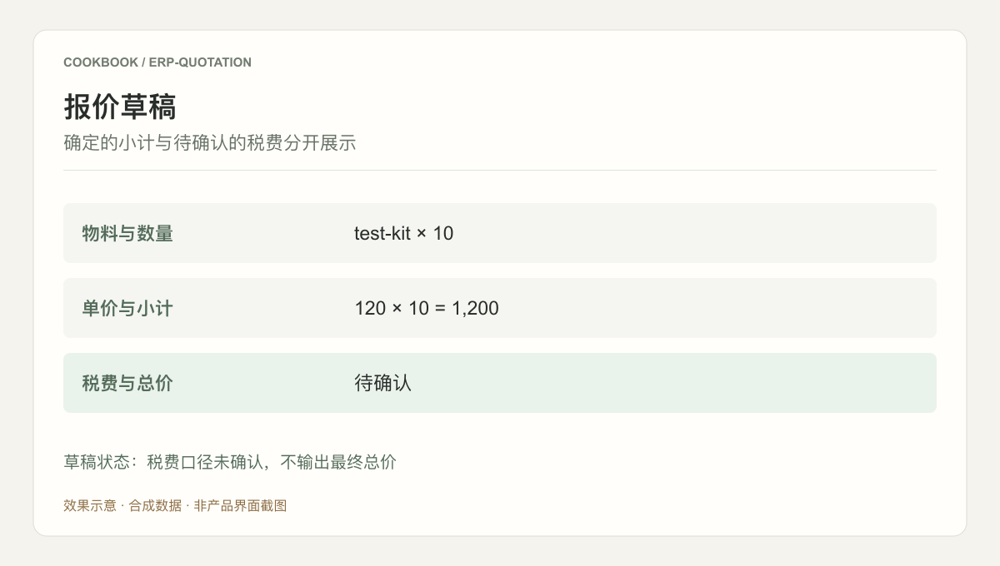
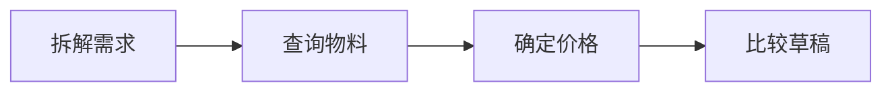

## 场景与成果

非标准采购需求很难直接对应一个料号。报价人员需要在物料、BOM、替代配置和价格规则之间反复核对，才能形成可供客户选择的方案。

将 ERP 的物料、BOM、定价和报价接口接入 Agent，探索从口语需求到候选报价方案的流程。

本文根据泡鲁达提供的 showcase 资料整理。流程图与分工表用于解释案例中的方法；后面的具体示例是复用建议，不作为生产运行的实测结论。

### 效果预览



根据本文案例绘制的结果示意，使用合成数据，非产品截图。草稿状态：税费口径未确认，不输出最终总价

## 实现思路

### 一次任务如何流经产品

原案例为概念验证：模型理解需求并选择业务工具，ERP 提供物料与价格事实，最终方案需要保留使用的业务数据。



每个环节都需要把自己的输入与结果交给下一步。后续步骤据此继续工作，用户也能沿着这条链查看结果从哪里产生、在哪一步需要确认。

### 角色分工与权威事实

| 组成部分 | 在案例中的职责 |
|---|---|
| Agent | 澄清需求并组织候选方案 |
| ERP | 物料、BOM 与价格事实 |
| 报价流程 | 核算、确认与正式提交 |

模型可以解释需求与方案，不能替代 ERP 的价格事实。将生成草稿与正式提交分开，能让使用者先检查料号、数量、税费和有效期。

### 沿着一个具体任务展开

用测试物料库为“十套设备配套备件”生成两份候选报价：标准配置和增强配置，均保持草稿状态。

1. **拆解需求**：识别用途、数量、交付时间和约束；信息缺失时补问，避免猜测规格。
2. **查询物料**：调用 ERP 查询候选料号、BOM 和可替代项，保留原始物料标识。
3. **确定价格**：以 ERP 返回的价格、币种、有效期和税费口径为准，由确定性程序核算小计。
4. **比较草稿**：展示两套方案的差异、未决条件和价格依据；确认前不写入正式报价单。

这条流程的交付物需要保留过程中使用的依据。某一步缺少数据或执行失败时，应让状态继续可见，避免后续环节把它当作已经完成的结果。

### 让结果可以被核对

下面用一组合成数据说明预期交付。它是应用侧的说明样例，不是 QCA API 请求，也不是生产记录。

```json
{
  "input": {
    "part": "test-kit",
    "quantity": 10,
    "unit_price": 120,
    "tax_basis": "excluded"
  },
  "expected": {
    "subtotal": 1200,
    "tax": "unresolved",
    "state": "draft"
  }
}
```

小计可以确定，但税费口径尚未补全，总价应保持待确认。模型不应自行补一个税率来让报价看起来完整。

## 复用建议

落地时可以先复现上面的一个任务，用已知输入核对交付结果，再补齐下面这些失败或歧义场景。通过后再扩大任务范围。

| 失败或歧义场景 | 需要保留的行为 |
|---|---|
| 物料名称有多个匹配 | 列出差异并补问，不任选料号。 |
| 价格已过有效期 | 重新查询或标记待核价。 |
| 重复点击生成 | 复用同一草稿标识，避免重复单据。 |