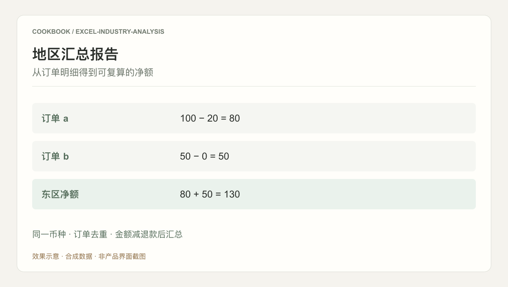

## 场景与成果

同一个销售问题，换一份工作簿就可能需要重新解释字段、单位和统计口径。行业 Excel 分析的任务，是让业务人员确认这些差异后，继续用自然语言提问。

以字段映射和问题分析两个角色理解陌生表格，将自然语言问题转成受约束的计算配置。

本文根据阿米提供的 showcase 资料整理。下文的完整演练用于说明接入方法，不作为生产运行的实测结论。

### 效果预览



根据本文案例绘制的结果示意，使用合成数据，非产品截图。同一币种 · 订单去重 · 金额减退款后汇总

## 实现思路


Mapper 负责提出字段与单位映射，Analyzer 负责把问题变成允许执行的计算计划，确定性代码负责数值计算。下面通过一个可运行的完整样例说明三者怎样交接，避免把字段理解和算数混在同一段回答里。

### 完整操作示例：从陌生工作表到地区净销售额

假设业务人员问：“八月各地区的净销售额是多少？”先不要直接让 Agent 对整张表给结论。下面六行合成数据包含大小写别名、完全重复的订单、跨月订单和缺失地区，足够检验从字段理解到结果解释的完整链路。

| 订单 | 日期 | 地区 | 金额 | 退款 | 币种 |
|---|---|---|---|---|---|
| A | 2026-08-01 | east | 100 | 20 | CNY |
| B | 2026-08-02 | East | 50 | 0 | CNY |
| B | 2026-08-02 | East | 50 | 0 | CNY |
| C | 2026-08-03 | west | 80 | 10 | CNY |
| D | 2026-07-31 | east | 40 | 0 | CNY |
| E | 2026-08-04 | 空 | 60 | 0 | CNY |

### 第一步：让 Mapper 提出映射，而不是直接计算

可以先发送下面这条请求，并把样本与列名作为输入：

> 请识别订单标识、业务日期、地区、金额、退款和币种。列出需要确认的字段口径、地区别名与异常行策略，先不要计算最终结果。

在这个样例中，至少要确认三件事。第一，行代表完整订单而非订单明细，因此完全相同的订单可以去重；如果是多行明细，必须改用明细标识。第二，金额是退款前金额，净额才可以定义为金额减退款。第三，East 与 east 属于同一区域，空地区不能静默归入东区。

确认后保存映射与口径版本。后续只换提问、不换工作簿时，可以复用映射；换了列名、单位或业务粒度，则应重新确认受影响部分。

### 第二步：把业务问题编译成允许执行的配置

> 使用已确认的映射，查询 2026 年 8 月各地区净销售额。按订单标识去除完全重复行，筛选业务日期，按标准地区分组，聚合金额减退款。返回计算配置及异常处理计划，不执行任意代码。

执行器需要检查日期范围、字段与操作是否被支持。本例采用左闭右开的八月日期范围，固定 CNY，缺失地区进入排除清单。同一订单标识对应不同金额时不能简单“保留第一条”，应停止并要求确认冲突来源。

### 第三步：运行确定性计算，保留排除明细

下面的 Python 3 示例可直接保存运行，仅依赖标准库。它用 CSV 文本模拟从工作簿读出的行，演示计算边界；不是原项目源码，也不包含 Excel 上传、模型调用或权限系统。

```python
import csv
import io
from decimal import Decimal

source = """order_id,date,region,gross,refund,currency
A,2026-08-01,east,100,20,CNY
B,2026-08-02,East,50,0,CNY
B,2026-08-02,East,50,0,CNY
C,2026-08-03,west,80,10,CNY
D,2026-07-31,east,40,0,CNY
E,2026-08-04,,60,0,CNY
"""
aliases = {"east": "east", "west": "west"}
seen, totals, excluded = {}, {}, []
for row in csv.DictReader(io.StringIO(source)):
    key = row["order_id"]
    if key in seen:
        if seen[key] != row:
            raise ValueError(f"Conflicting duplicate: {key}")
        excluded.append((key, "duplicate"))
        continue
    seen[key] = row
    if not "2026-08-01" <= row["date"] < "2026-09-01":
        excluded.append((key, "outside period"))
        continue
    region = aliases.get(row["region"].strip().lower())
    if region is None:
        excluded.append((key, "unmapped region"))
        continue
    if row["currency"] != "CNY":
        raise ValueError("A currency conversion policy is required")
    gross, refund = Decimal(row["gross"]), Decimal(row["refund"])
    if not gross.is_finite() or not refund.is_finite():
        raise ValueError("Non-finite amount")
    totals[region] = totals.get(region, Decimal(0)) + gross - refund

assert totals == {"east": Decimal(130), "west": Decimal(70)}
assert len(excluded) == 3
print({region: str(value) for region, value in totals.items()})
print(excluded)
```

### 第四步：把结果解释成业务人员能核对的报告

运行后东区为 130，西区为 70，纳入汇总的净额合计为 200。六行输入中，三行被排除：重复的 B、跨月的 D、缺失地区的 E。报告应同时展示这两部分，避免把“没有进入汇总”误解为“金额为零”。

> 八月已识别地区的净销售额为 200 CNY，其中东区 130、西区 70。已排除一行完全重复订单、一行非八月订单，以及一行缺失地区的订单。缺失地区订单的净额为 60 CNY，尚未归入任何地区。

这个报告不能声称“八月全部净销售额只有 200”：仍有一笔 60 的八月记录等待补地区。补齐地区后应重新计算，同时保留本次映射与排除清单供对账。

### 再做三次小修改，检查边界是否真实生效

将重复 B 的金额改成 55，应报冲突，而不是随意选择 50 或 55。将 C 的币种改成 USD，应要求汇率与换算口径，而不是把不同币种相加。将 E 的地区补成 west，重新运行后西区应变成 130，合计应变成 260，排除记录剩两行。

上述示例刻意限定 ISO 日期和已知列名。用于真实工作簿时还要先处理多工作表、Excel 日期序列、合并表头和单元格类型；这些属于读取与映射阶段，不应该藏进报告生成提示词里。

## 复用建议

落地时可以先复现上面的一个任务，用已知输入核对交付结果，再补齐下面这些失败或歧义场景。通过后再扩大任务范围。

| 失败或歧义场景 | 需要保留的行为 |
|---|---|
| 同名金额列分别含税与未税 | 阻止自动合并，要求确认计算口径。 |
| 重复订单与空地区 | 输出去重及缺失记录数量，与人工参考表核对。 |
| 不支持的自然语言指标 | 明确拒绝或补问，不生成看似正确的数值。 |