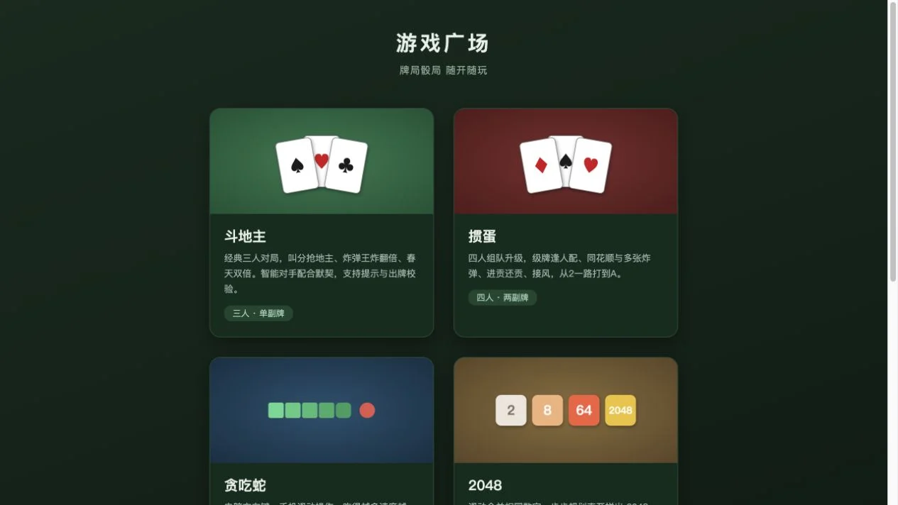
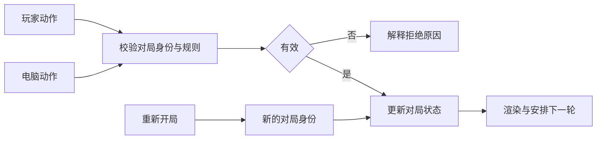

## 场景与成果

游戏广场将牌类与休闲小游戏组织为统一的浏览器入口。原 showcase 描述多个可直接游玩的前端游戏，并在斗地主、掼蛋中包含规则判定与电脑对手。

这个案例展示的是可交付的应用成果，而不是已证实每一步都由 Agent 自动生成的开发记录。正文围绕如何把规则、对局状态和交互组织为可玩的产品展开，避免用游戏截图推断未公开的开发过程。

游戏广场入口：牌局与小游戏按卡片组织。来源：原 showcase 素材。

## 实现思路

### 把状态转换作为可单独验证的核心

游戏画面可以在每次有效动作后根据新状态重绘。将规则检查和状态更新从按钮事件中分离，就可以直接测试一组输入动作得到什么结果，而不必每次都通过鼠标完整打一局。

电脑对手同样生成动作，再经过同一验证入口；计时器或动画结束不能直接修改未校验的业务状态。下面是参考应用结构，不暗示演示站公开了相应模块源码。

### 聚合入口与单局体验分开设计

入口卡片帮助用户知道是哪类游戏、支持什么玩法并开始体验。进入一局后，用户最需要的是当前状态、轮到谁、哪些动作有效，以及如何重新开始。

聚合页可以统一导航和样式，但各游戏规则不同，不应强行用同一组状态描述所有玩法。

### 规则层决定动作是否被接受

按钮禁用只改变界面，真正的有效性检查应在状态转换时执行。结束后提交普通移动动作，应保持结束状态；重新开局则创建新的对局状态。

牌类还需要检查轮次、牌型和持有的牌，不能因为电脑对手返回了一个动作就直接相信它合法。动作来源不同，规则应一致。

### 把重开和迟到动作一起测试

用户结束一局后立即重开，上一局尚未结束的电脑行动或计时器可能迟到。如果只清空画面，没有隔离对局身份，旧动作会污染新局。

为对局保留标识并清理旧调度，或在提交时拒绝旧局动作。验收时观察分数、轮次、牌面或棋盘是否真正复位，而不只是标题变了。

### 手机操作需要独立验收

鼠标容易完成的选择，在小屏触摸上可能误触。检查主要操作是否可辨认、状态提示是否被手指或底部区域遮挡，以及横竖屏变化后还能否继续对局。

可玩性还包括第一次用户是否理解错误动作为什么被拒绝。规则拒绝应提供与当前状态有关的提示，避免只显示“操作失败”。

## 复用建议

选择一款游戏，走完开局、合法动作、非法动作、结束与重开，再测试连续快速输入和迟到动作。把规则正确、状态恢复和视觉体验分别记录；一张入口截图只能覆盖最后一项的一部分。
