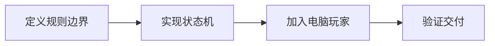

## 场景与成果

一个浏览器链接打开后，用户关心的是游戏是否能玩、规则是否一致、对局能否结束。游戏广场把 Agent 辅助开发的成果变成可以直接操作和分享的产品入口。

[打开在线入口](https://hao2-games.vercel.app)

将多种轻量游戏汇聚到浏览器入口，展示 Agent 交付可操作、可分享前端产品的一种形态。

本文根据何傲提供的 showcase 资料整理。流程图与分工表用于解释案例中的方法；后面的具体示例是复用建议，不作为生产运行的实测结论。

## 实现思路

### 一次任务如何流经产品

原案例集合包括棋牌和休闲游戏，规则判定、状态更新和电脑玩家运行在浏览器端。它展示的是软件交付成果，不表示每次出牌都由在线 Agent 推理。



每个环节都需要把自己的输入与结果交给下一步。后续步骤据此继续工作，用户也能沿着这条链查看结果从哪里产生、在哪一步需要确认。

### 角色分工与权威事实

| 组成部分 | 在案例中的职责 |
|---|---|
| 规则层 | 合法动作与胜负条件 |
| 状态层 | 回合、计分与重开 |
| 界面 | 输入和对局呈现 |

这类案例的成果是浏览器软件。不要把 Agent 参与开发与游戏运行时持续推理混为一谈；规则适合用确定性代码验证。

### 沿着一个具体任务展开

以一个可重复的测试对局验证“游戏能打开”和“规则正确”之间的差别，从合法操作、计分到重新开局逐项检查。

1. **定义规则边界**：选定一个游戏及其规则版本，明确胜负、回合和非法动作的处理。
2. **实现状态机**：用状态转换处理出牌或移动，界面从状态渲染，避免按钮回调各自修改比分。
3. **加入电脑玩家**：电脑动作经过同一规则校验，避免为电脑绕过合法性约束。
4. **验证交付**：覆盖手机操作、结束状态和重开，保存随机种子或动作序列便于复现。

这条流程的交付物需要保留过程中使用的依据。某一步缺少数据或执行失败时，应让状态继续可见，避免后续环节把它当作已经完成的结果。

### 让结果可以被核对

下面用一组合成数据说明预期交付。它是应用侧的说明样例，不是 QCA API 请求，也不是生产记录。

```json
{
  "input": {
    "state": "finished",
    "action": "player-move"
  },
  "expected": {
    "accepted": false,
    "state": "finished"
  }
}
```

结束态拒绝普通游戏动作，但允许明确的重新开局动作。这个状态检查应由规则层负责，不能只通过隐藏按钮实现。

## 复用建议

落地时可以先复现上面的一个任务，用已知输入核对交付结果，再补齐下面这些失败或歧义场景。通过后再扩大任务范围。

| 失败或歧义场景 | 需要保留的行为 |
|---|---|
| 用户连续点击出牌 | 同一回合只接受一次有效动作。 |
| 电脑生成非法动作 | 拒绝动作并采用合法回退。 |
| 结束后重新开局 | 清除旧计分与定时器状态。 |