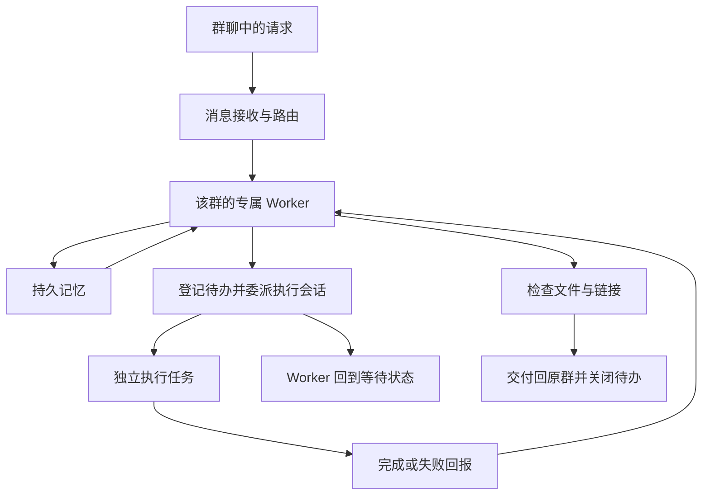

## 场景与成果

群聊里的 Agent 可以很快回答一个问题。但当请求变成“做一个可以打开的 Demo”，服务就需要跨越多个阶段：理解需求、派发任务、等待执行、检查产物，再把结果送回正确的群。持续在线的入口和耗时的执行任务，不能共用一条一直阻塞的处理链。

何傲的 [何傲² 数字分身系统 V1.1 报告](https://hao2-v1-report.vercel.app) 描述了一套已经运行的群聊接单与交付系统；其 [主 Agent Managed 子 Agent 方法说明](https://hao2-agent-managed.vercel.app) 将 HAO2 列为基于 QCA 的异步任务实例。

作者报告的能力包括群聊问答、Demo 开发与部署、文件交付及授权范围内的本地协同。本篇聚焦任务编排，依据两份公开材料整理；未访问其运行后台或独立复测生产指标，因此不把报告中的成本、初始化速度和在线规模数字作为收益承诺。

这个案例的价值在于交付闭环：用户在原来的群聊中提出请求，任务由专职会话推进，完成后回到同一协作入口。交付物可以是文件或经过可用性检查的链接，而不只是“我已经做完了”的文字。

## 实现思路

### 群聊入口和任务执行分开

公开报告把消息链路拆成消息接收、路由、各群专属 Worker 和任务子会话。专属 Worker 承接该群的上下文；遇到复杂工作，再委派给执行会话。消息接收组件有独立的守护机制，不需要把长任务一直留在入口进程里。

下面按两份公开材料抽象出任务链路，省略与复用无关的个人功能和业务配置：

### 长任务靠回报推进，不靠持续空等

方法说明中，HAO2 在派发工作后登记 `pending_jobs` 并返回等待状态，后续由执行方回报推动收尾。这里的关键不是变量名，而是把“有任务尚未结束”保存成可恢复状态。

如果等待只存在于主会话的一段对话中，重启或上下文变化就可能丢失任务。显式登记则给恢复、超时处理和最终核销提供了落点。持续问执行方“好了没有”也不能替代明确的完成或失败通知。

复用时可采用下面的状态设计。这是本篇给出的实现建议，不是原系统公开的数据库字段定义：

| 状态 | 最少需要保留的信息 | 下一步 |
|---|---|---|
| 已接收 | 原群、请求标识、任务目标 | 分配执行者 |
| 已委派 | 执行会话、委派时间、截止条件 | 等待回报 |
| 待验收 | 产物引用、执行结果、失败原因 | 检查是否达到目标 |
| 已交付或失败 | 交付消息标识或失败说明 | 关闭任务，保留记录 |

### 记忆、会话与任务有不同寿命

作者的报告介绍了持久记忆与群专属上下文，方法说明则区分了任务收尾、Worker 待命和退役会话归档。它们不应被合成一个“全部删除”的清理动作：任务结束不代表该群需要忘掉已有知识，Worker 空闲也不代表没有待回报的工作。

对复用者而言，群路由只是隔离的一部分。还应在文件、凭证和交付目标上明确归属，不能只依靠提示词要求“不跨群”。公开材料描述了隔离目标，本篇没有对其底层隔离强度进行审计。

### 验收是交付前的独立阶段

公开方法说明要求交付原文件与链接，并在部署后检查链接可用性。这比仅由执行 Agent 宣布成功更明确，但 HTTP 200 只证明页面能响应，不代表功能符合请求。

因此，移植这套模式时应把业务验收条件随任务一起传下去。例如“交付一个报名页面”，至少需要检查页面能打开、必填项正确、提交结果可观察，以及失败时有明确反馈。

## 复用建议

从一个群、一类任务、一个执行者开始，把闭环跑完整，再增加并行角色。先验证以下故障场景，往往比提前增加很多 Agent 更有价值：

1. 主 Worker 在委派后重启：仍能找到待办，回报不会成为无主消息。
2. 执行方重复发送完成通知：最终只交付一次，不重复核销或重复通知。
3. 执行失败或超过截止时间：原群收到可理解的状态，而不是一直等待。
4. 两个群提出相似任务：产物、消息和可用凭证均不会混用。
5. 文件已生成但链接打不开：任务保持待验收或失败，不能宣告交付完成。

上述场景是建议的验收清单，未在作者系统上实际执行。需要按自己的消息平台、任务时长和资源预算设定截止条件，不必照搬原系统的固定时间参数。

这套模式适合异步交付报告、开发任务和文件处理。对于一次短问答，额外创建多个角色可能只增加复杂度。判断是否需要子会话，应看任务是否需要独立上下文、权限或较长执行时间。

## 公开来源与范围

- [何傲² 数字分身系统 V1.1 报告](https://hao2-v1-report.vercel.app)：作者发布于 2026 年 8 月 8 日的系统说明。
- [主 Agent Managed 子 Agent：方法与全生命周期](https://hao2-agent-managed.vercel.app)：其中 HAO2 部分说明异步委派与回报处理。

本篇未搬运群聊记录、个人文件、声音素材、凭证或客户项目细节，也不提供原系统的可运行源码包。图示和验收建议是针对公开描述重新整理的复用视角。
