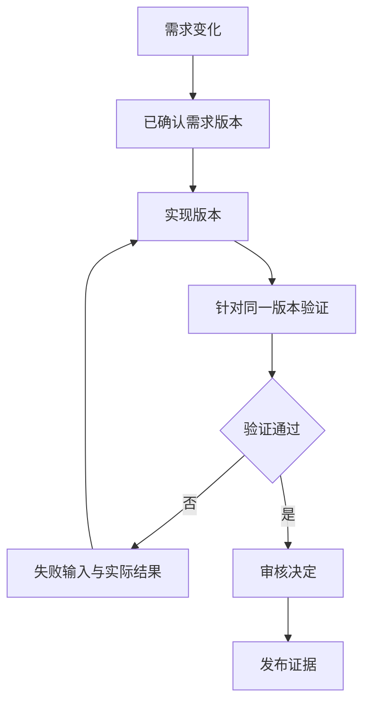

## 场景与成果

> **资料待补充。** 原运行界面含内部项目内容；尚缺可公开的任务图、代码变更与验证记录。

研发任务会经历需求澄清、计划、实现、验证和发布，但这些阶段并不总是顺序走完：需求可能变更，验证可能失败，某一步可能需要人工决定。把所有动作藏在一个长会话里，容易看不清已经完成了什么、哪些结论已经过期。

Harness 的原 showcase 用 Graph 管理阶段、依赖、回退和人工决策，由 Agent 执行节点内的工作。以下以一个输入校验需求展开参考任务图。原始界面包含内部项目数据，因此用任务契约解释机制，不把内部任务截图或生产状态对外展示。

## 实现思路

### 图状态与执行状态怎样对齐

图上的节点最好表示有明确产物的业务阶段，而不是每一句 Agent 思考。节点过细会把实现细节暴露给用户，过粗又无法判断该从哪里恢复。先用需求、实现和验证三个阶段即可观察依赖关系，计划和发布可以在需要时增加。

等待工具返回时，节点仍在执行；工具失败时记录失败证据；需要确认业务选择时进入人工等待。三者在界面上应有区别。下面是参考的验证回退关系，重点是回退带着失败依据，并在重新验证前产生新的实现版本。

### 把需求写成能判定完成的节点

假设需求是“允许输入 1 到 100 的整数，其他输入给出错误提示”。需求节点应交付范围、端点规则、错误行为和参考用例；计划节点说明受影响位置；实现节点交付代码版本；验证节点交付与该版本绑定的结果。

节点完成不能只依赖一条“done”消息。实现完成要有代码，验证完成要有对应版本的结果，发布完成要有环境中实际生效的版本。

### 回退时传回证据，而不是一句失败

验证发现输入 51 被接受，应返回触发输入、实际输出、期望输出、所测代码版本和复现方式。实现节点修复后生成新版本，验证对新版本重新执行。

如果是验证环境不可用，应该记录基础设施阻塞，不能让实现 Agent 为此盲目改业务代码。区分代码失败、环境失败和人工等待，才能选择正确的回退位置。

### 人工决策与重试也要有版本

确认的对象应是具体需求或代码版本。审核 v1 不等于审核 v2；发布允许也不能自动套用到后续新增改动。节点重试应保留尝试记录，让迟到的旧结果无法覆盖当前结果。

可以将节点身份、输入版本和尝试标识一起记录。Graph 管理这些状态，Agent 负责解释和执行节点工作，两者的职责因此清楚。

## 复用建议

先搭需求、实现、验证三个节点，主动改变需求并制造验证失败，检查失效与回退。再加入发布阶段。重点观察每个绿色状态背后是否有当前版本证据，而不是任务图看起来是否完整。
