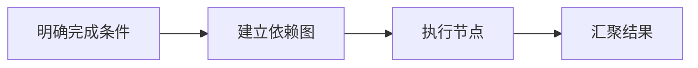

## 场景与成果

研发任务会经过需求、实现、验证等不同阶段，也会因为需求变化或测试失败而回退。Harness 用任务图呈现这些依赖，让每个阶段有独立的完成依据。

将需求澄清、计划、开发、验证和发布组织成有依赖关系的任务图，使回退与人工决策点可见。

本文根据蛋总/与天提供的 showcase 资料整理。流程图与分工表用于解释案例中的方法；后面的具体示例是复用建议，不作为生产运行的实测结论。

## 实现思路

### 一次任务如何流经产品

Graph 描述阶段及其依赖，Agent 承担阶段内的理解和执行。阶段完成需要提交对应证据，失败可回到相关节点处理，而非重新启动整段对话。



每个环节都需要把自己的输入与结果交给下一步。后续步骤据此继续工作，用户也能沿着这条链查看结果从哪里产生、在哪一步需要确认。

### 角色分工与权威事实

| 组成部分 | 在案例中的职责 |
|---|---|
| 任务图 | 阶段、依赖与回退 |
| Agent | 完成节点内专业工作 |
| 验证与人 | 检查产物并决定状态转换 |

任务图适合存在依赖、回退和人工门禁的交付过程。简单一次性任务可以保持线性；图越复杂，越需要清楚的节点完成契约。

### 沿着一个具体任务展开

在测试仓库实现一个输入校验功能，把需求、实现和验证作为可恢复的图节点，而不是一段不可分割的长对话。

1. **明确完成条件**：把“支持非法输入提示”改写为允许输入、错误行为和参考用例。
2. **建立依赖图**：实现依赖需求确认，验证依赖代码产物，发布依赖授权与验证结果。
3. **执行节点**：每个节点记录输入版本、输出产物和工具结果，失败只回退受影响节点。
4. **汇聚结果**：展示各节点证据与未决项，让人工决策改变明确的图状态。

这条流程的交付物需要保留过程中使用的依据。某一步缺少数据或执行失败时，应让状态继续可见，避免后续环节把它当作已经完成的结果。

### 让结果可以被核对

下面用一组合成数据说明预期交付。它是应用侧的说明样例，不是 QCA API 请求，也不是生产记录。

```json
{
  "input": {
    "requirements_version": 2,
    "implementation_based_on": 1,
    "tests": "passed"
  },
  "expected": {
    "implementation": "stale",
    "delivery": "blocked"
  }
}
```

测试通过只能证明旧需求下的实现通过检查。需求版本变化后必须重新判断实现和测试是否仍覆盖当前目标。

## 复用建议

落地时可以先复现上面的一个任务，用已知输入核对交付结果，再补齐下面这些失败或歧义场景。通过后再扩大任务范围。

| 失败或歧义场景 | 需要保留的行为 |
|---|---|
| 需求在开发后变更 | 使相关下游节点失效并重新验证。 |
| 验证失败 | 返回实现节点，保留失败证据。 |
| 节点重试产生旧产物 | 按输入版本拒绝过期输出。 |