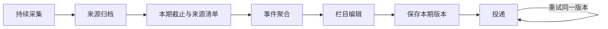

## 场景与成果

> **资料待补充。** 当前入口为内网；缺少可公开的一期完整简报与编辑过程截图。

信息站的产品不是搜索结果列表，而是一份按时送达的编辑产物。原 showcase 描述 Cloud Agents 持续采集、结构化、聚合科技信息，并在每天 08:30 形成必看、追踪、弱信号和产品趋势简报。

可公开资料只说明产品流程，没有开放采集器或编辑评测。下文区分原资料描述的产品栏目与供接入者参考的编辑建议。

## 实现思路

### 采集频率与交付频率不必相同

信息可以持续进入，但一期简报需要固定的输入集合。到达截止时间后冻结本期来源清单，再完成去重和编辑；新到的材料进入下一期或明确的更新，不应在同一期重试发送时悄悄改变内容。

采集器只负责得到材料，不应决定所有编辑优先级。编辑阶段依据主题和受众选择内容，交付阶段负责同一版本的送达。这种拆分也让故障定位更具体：来源缺失查采集，重复事件查聚合，摘要失真查编辑，未送达查投递。

### 先定义一期简报的时间边界

采集时间、文章发布时间和事件发生时间是三回事。今天转载的旧新闻不应自动成为今日新事件；昨天发生但今天才取得可靠材料的事件，则可以作为补充更新。

每期保存采集截止时间和来源覆盖情况。某个来源故障时，简报注明缺口，而不是拿旧内容填满固定条数。

### 先按事件聚合，再安排版面

来源 A 与 B 都报道产品 X 发布，来源 C 报道产品 Y。输出应是两个事件，X 条目保留 A、B 两个来源。去重不能简单删除第二个链接，因为它可能提供不同事实或交叉验证。

标题相似不保证事件相同；同一产品两次发布也不能合并。聚合应核对主体、动作、版本和时间，存在冲突时保留冲突信息。

### 四种栏目承担不同阅读任务

必看回答“今天最值得关注什么”；追踪说明此前事件有什么新进展；弱信号保留尚未充分确认但值得继续观察的线索；产品趋势需要跨多个事件的依据。

单个发布不能独自支撑行业趋势。弱信号应说明不确定性和后续观察点，不能只是给猜测换一个栏目名称。栏目可以为空，编辑判断比固定条数更重要。

### 把编辑修正带入下一期

每条摘要应能回到原文，事实与编辑判断分开。当来源修正发布时间、数字或产品范围时，下一期可以说明更新，并保留上一期的修订记录。

发送超时属于交付问题，不应重新采集并生成一份不同内容的“同一期”。先保存本期产物，再对同一版本进行投递重试。

## 复用建议

用一个有限来源清单连续运行数期，人工检查重复事件、过期新闻、失效链接和缺乏来源的判断。评估新增信息量与可核对性，而不是每天生成字数。扩展来源前，先确认一期简报可以被完整回放。
