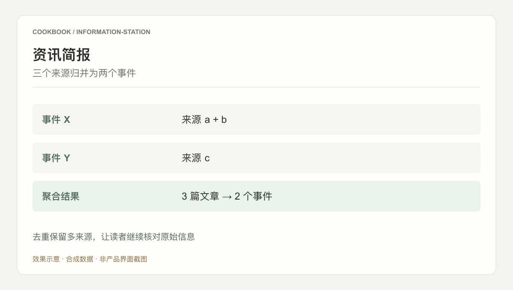
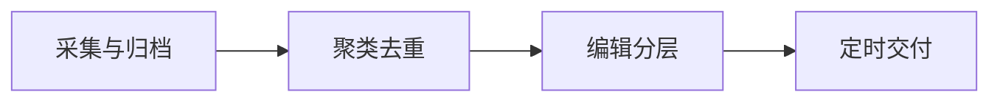

## 场景与成果

信息站面对的输入不是一道问题，而是每天持续增加的资讯。产品需要从重复报道中找到事件，保留出处，再把读者真正需要关注的变化编成简报。

将信息采集、去重、主题聚合和编辑组织成定时任务，交付一份有来源、有重点的科技简报。

本文根据信息站共创团队提供的 showcase 资料整理。流程图与分工表用于解释案例中的方法；后面的具体示例是复用建议，不作为生产运行的实测结论。

### 效果预览



根据本文案例绘制的结果示意，使用合成数据，非产品截图。去重保留多来源，让读者继续核对原始信息

## 实现思路

### 一次任务如何流经产品

输入是持续到达的信息，输出是固定时间交付的简报。采集与编辑分离，编辑阶段区分必看、持续追踪和弱信号，避免将链接堆积当作情报产品。



每个环节都需要把自己的输入与结果交给下一步。后续步骤据此继续工作，用户也能沿着这条链查看结果从哪里产生、在哪一步需要确认。

### 角色分工与权威事实

| 组成部分 | 在案例中的职责 |
|---|---|
| 采集层 | 来源与原始内容 |
| 编辑 Agent | 聚类、筛选和摘要 |
| 发布层 | 期次、时间与投递状态 |

简报价值来自选题和可追溯性，不是每天凑满固定条数。可以先固定来源和人工编辑规则，确认质量后再扩大来源范围。

### 沿着一个具体任务展开

用十条公开测试资讯生成一份晨报，要求每条结论能回到原始来源，并区分已发生事件与观察信号。

1. **采集与归档**：记录来源地址、发布时间、采集时间与原文摘要，重复抓取使用同一内容键。
2. **聚类去重**：按事件合并转载，同一发布的不同报道作为补充来源，不重复占据版面。
3. **编辑分层**：按重要事件、持续追踪和弱信号组织内容，为每条判断说明依据与不确定性。
4. **定时交付**：检查链接与日期后发布，保存本期输入和输出；无新增信息时允许缩短简报。

这条流程的交付物需要保留过程中使用的依据。某一步缺少数据或执行失败时，应让状态继续可见，避免后续环节把它当作已经完成的结果。

### 让结果可以被核对

下面用一组合成数据说明预期交付。它是应用侧的说明样例，不是 QCA API 请求，也不是生产记录。

```json
{
  "input": {
    "articles": [
      {
        "id": "a",
        "event": "release-x"
      },
      {
        "id": "b",
        "event": "release-x"
      },
      {
        "id": "c",
        "event": "release-y"
      }
    ]
  },
  "expected": {
    "event_count": 2,
    "events": [
      {
        "id": "release-x",
        "sources": [
          "a",
          "b"
        ]
      },
      {
        "id": "release-y",
        "sources": [
          "c"
        ]
      }
    ]
  }
}
```

编辑结果按事件而非链接计数。读者仍能查看同一事件的两个来源，避免去重时丢失交叉验证信息。

### 实际操作：从第一条请求开始

下面是一条可用于测试环境的复现任务，用来走通应用流程；不代表原产品未公开的内部实现。

> 将这些材料整理成按事件组织的简报。合并转载，保留每个事件的来源与发生时间，区分已确认信息和持续跟踪项。

准备同一发布的两篇报道和另一个独立发布。简报应有两个事件条目，但第一条仍保留两份来源。接着加入一篇当天转载的旧新闻，检查它是否因转载时间较新而被误列为今日新事件。

### 读懂结果，再试一次反例

第一轮跑通后，只改变一个条件：**同一消息来自三个转载源**。此时应当看到的行为是：合并为一条事件，保留来源。 将前后两次结果并排保留，核对是判断发生了合理变化，还是某一步没有输出。


## 复用建议

落地时可以先复现上面的一个任务，用已知输入核对交付结果，再补齐下面这些失败或歧义场景。通过后再扩大任务范围。

| 失败或歧义场景 | 需要保留的行为 |
|---|---|
| 同一消息来自三个转载源 | 合并为一条事件，保留来源。 |
| 旧新闻被重新发布 | 区分事件时间与转载时间。 |
| 采集源暂不可用 | 说明覆盖缺口，不以旧稿冒充新稿。 |