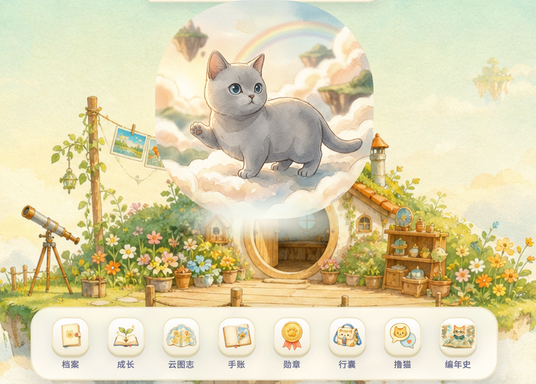
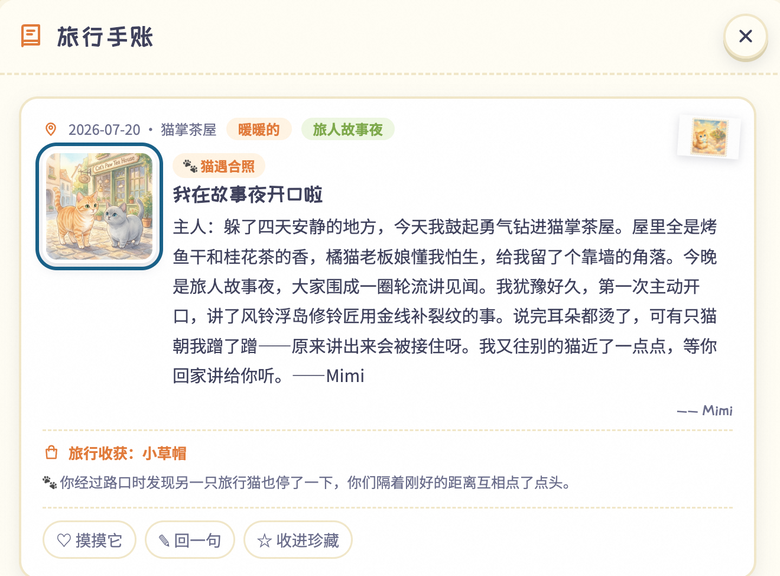
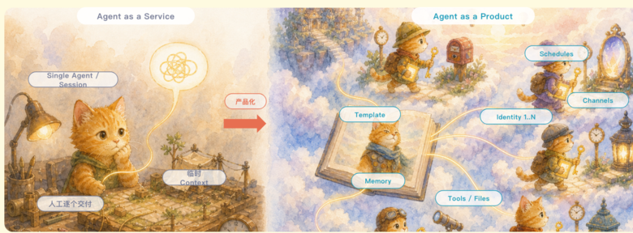

## 场景与成果

在 [LittleMemeWorld（Me&Me · 我&猫）](https://littlememeworld.com) 里，每位用户都会拥有一只属于自己的小猫。用户离开页面后，小猫仍会按计划在云上世界旅行。它会积累经历和记忆，也会带回旅行手账、照片和成长结果。


为了让这只猫持续生活，我们把 Qoder Cloud Agents（QCA）放在了产品的核心位置。小猫的身份、长期记忆、定时行为和工具能力都由 QCA 承载。用户每次回来，看到的都是同一只继续成长的猫，以及它离线期间留下的新故事。



一段旅行结束后，结果会进入旅行手账。用户可以查看故事、照片和收获，也可以做出新的选择。这次回应会继续影响小猫接下来的行动。



产品里同时运行着两个循环：

- **生命循环**：用户表达意图，小猫出发旅行，把手账和记忆带回来，再根据用户的选择继续生活；
- **进化循环**：用户提交反馈，系统形成提案和验收标准，完成隔离开发、测试、审批、灰度与观察，最后保留新版本、继续修复或执行回滚。


这两个循环都已经进入真实产品链路。QCA 一边承载每只猫每天的运行，一边承载持续维护 LittleMemeWorld 的多 Agent 工作流。猫在成长，软件也会跟着用户的反馈继续变化。

## 实现思路

### 一只猫由一组长期资源组成

在产品里，每只猫都由一组可以独立维护的 QCA 资源承载：

| QCA 资源 | 在 LittleMemeWorld 中的职责 |
|---|---|
| Template | 保存共享的人格边界、工具、文件和任务规则，并记录版本 |
| Identity | 为每只猫提供稳定身份，让多次运行始终属于同一个产品实体 |
| Schedule | 在用户离线时触发旅行、维护和其他周期任务 |
| Session | 在清晰的任务边界内保持执行连续性，并支持暂停和恢复 |
| Memory | 保存偏好、经历、日记和对世界的理解，让小猫持续成长 |
| Tools / Files | 让小猫在最小权限下读取世界、生成成果并回报应用 |



这组资源给了小猫连续的身份和经历。与此同时，登录、权限、奖励、幂等和发布状态仍由确定性的应用控制面管理。Agent 可以自由规划旅行和讲述见闻，所有会改变产品事实的动作都要经过应用校验。

| QCA Agent 负责 | 应用控制面负责 |
|---|---|
| 理解用户意图和长期上下文 | 认证、授权和资源归属 |
| 规划旅行、形成观察和叙事 | 业务日期、唯一约束和幂等 |
| 使用 Memory 保持人格与经历连续 | 用户、奖励、发布状态等权威事实 |
| 调用受限工具并产出结构化结果 | 校验结果、应用副作用和用户可见状态 |

### 把一条反馈送到生产观察

我们在产品里做了一个很直接的入口，叫“告诉皮卡”。用户提交反馈后，可以看到它进入评估、实现或上线流程，也会收到后续回应。


这套自进化流水线已经完整运行。一条反馈会依次经过这些环节：

1. 收件 Agent 增量读取反馈，完成脱敏并写入追加式记录；
2. 评估 Agent 聚类问题，整理影响范围，形成提案和验收标准；
3. 开发 Agent 在隔离环境中实现变化，并运行自动测试；
4. 独立复核绑定具体版本和 exact SHA，历史结论不能直接复用；
5. 风险策略和人工审批决定能否合并以及能否进入生产；
6. 新版本进入灰度和观察窗口，系统持续监控真实产品结果；
7. 系统根据观察证据保留版本、继续修复或回滚，并向用户回信。


我们把审批、灰度、回滚和熔断直接做进了流水线。不同职责使用各自的 Identity、Session、工具和权限。读取反馈的 Agent 没有生产修改权限，高风险变更也必须由独立角色和人来批准。

每次变化都会留下同样的证据链：

> feedback → work item → Agent run → branch / PR → exact SHA → staging → production bundle → observation → verified

缺少证据、测试失败、版本不匹配或核心指标恶化时，流水线会停下、冻结或回滚。团队可以沿着这条链回看一次变化从哪里开始、经过了哪些判断，以及最后为什么被保留或撤回。

### 两个循环在结构化事实处汇合

生命循环会产生旅行结果、运行信号和用户反馈。进化循环读取这些证据，把它们转化为经过验证的新版本，再将新版本交回生命循环。

两个循环交换的是结构化事实和版本证据。产品里的小猫只拥有完成旅行所需的权限；开发、发布和云资源操作由另外的 Identity 和工具承担。QCA 贯穿整个产品，同时保留了清晰的职责边界。

## 复用建议

LittleMemeWorld 这段实践留给我们的结论很直接：长期 Agent 的运行循环和软件进化循环可以共享一套 QCA 底座；两个循环通过结构化事实和版本证据交换结果，各自保留独立的 Identity、Session、工具和权限。这样的结构让产品持续生活，也让软件在清晰边界内持续演进。

### 实践演练：从任务到验收

用测试角色完成一次离线旅行和一次反馈驱动的变更提案，分别检查产品行为与软件变更的验收。

以下是可复用的实现与验收建议，不代表演示站已公开这些后端能力，也不表示这些检查已经执行通过。演练使用合成或获授权输入；JSON 是应用侧记录示意，不是 QCA API 请求。

### 分步实现与交付物

#### 1. 固定角色上下文

记录测试个性和记忆范围，避免不同角色的状态混用。

#### 2. 触发一次活动

观察定时任务与故事产物的关联，重试不重复产生同一事件。

#### 3. 提交测试反馈

把反馈转成明确问题与验收条件，不直接等同于修改指令。

#### 4. 复核变更产物

检查代码、验证结果和最终用户体验，再决定接受变更。

### 输入输出记录示例

```json
{
  "character": "test-cat",
  "activity": "demo-trip",
  "feedback": "test-feedback",
  "acceptance": [
    "memory-scope",
    "single-delivery",
    "verified-change"
  ]
}
```

将这份记录与产物或报告一起保存，用来回答“这份结果来自哪个输入、哪个版本”。凭证不写入记录。输入变化后应重新判断旧结果是否适用，不能静默复用。

### 故障与验收检查

| 检查条件 | 预期结果 |
|---|---|
| 定时任务重复触发 | 同一活动不重复交付。 |
| 用户删除记忆 | 后续行为不继续依赖已删除内容。 |
| 反馈含糊 | 先澄清，不随意更改产品行为。 |

为每个检查准备可重复输入，记录实际观察。验收时对照产物、状态或数值，不只阅读一段看似合理的解释；尚未验证的项目保留为待验收，不能按通过统计。

### 关键取舍

长期角色连续性和代码自进化是两个验证目标。不要用一次成功故事生成来证明变更流水线可靠。
