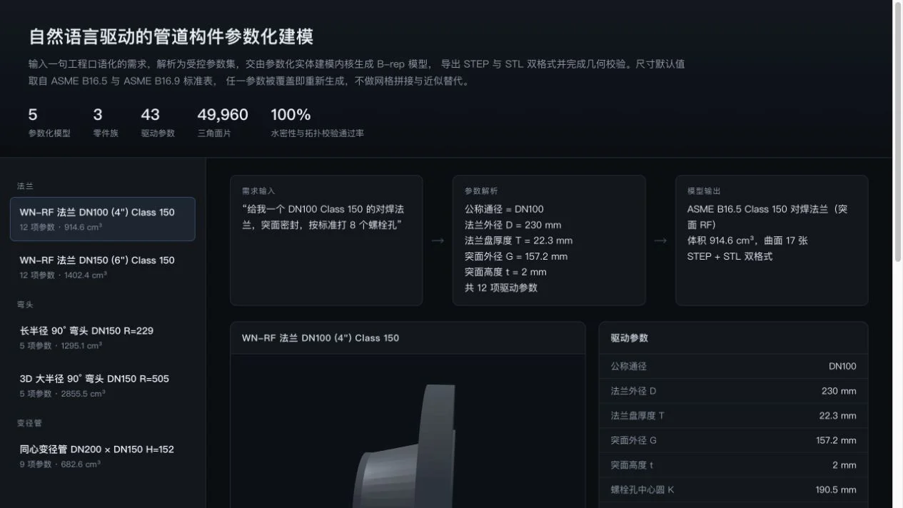

## 场景与成果

[打开在线演示：自然语言驱动的管道构件参数化建模](https://hao2-llm2cad-pipeline.vercel.app)

工程师说“做一个 DN150 的长半径 90° 弯头”，真正需要的交付物是可检查、可继续加工的几何模型。何傲的这份行业智能演示，把工程描述、参数表、三维构件和下载文件放在同一工作台，展示了一种比聊天回答更具体的 Agent 交付方式。

*图片来自 showcase 中的演示截图，原案例作者：何傲。本文根据公开页面与实际交互整理。*

### 三分钟体验

1. 打开左侧的长半径弯头样例，观察描述与参数表同步切换。
2. 旋转、缩放三维模型，切换实体与线框，检查构件形态。
3. 对照几何检查区域，再下载 STEP 或 STL 文件。页面也提供预览 PNG。

公开页面包含法兰、弯头、异径管三类共五个样例。实测切换到 DN150 长半径弯头后，显示外径 168.3、壁厚 7.11、中心线半径 229、角度 90°，并提供对应的 [STEP 文件](https://hao2-llm2cad-pipeline.vercel.app/assets/step/elbow_dn150_lr.step)与 [STL 文件](https://hao2-llm2cad-pipeline.vercel.app/assets/stl/elbow_dn150_lr.stl)。这些数值用于说明样例如何呈现，不构成选型依据。

当前在线版本是**预生成样例的交互查看器**：可以切换构件、检查参数、操作三维视图和下载文件，没有任意输入新指令并现场生成 CAD 的入口。

## 实现思路

### 让一次交付形成可追溯的链条

页面公开的样例数据将请求文本、结构化参数、几何检查结果和文件路径关联起来。读者能沿着一条完整链条判断结果，而不是只看一张模型截图。

上图是从展示内容归纳的交付流程。公开页面说明使用 CadQuery 与 OpenCASCADE，但页面本身没有公开可核对的生成服务或 QCA 会话轨迹，不能据此断言完整后端如何编排。

| 交付层 | 用户能检查什么 | 可复用的设计 |
|---|---|---|
| 工程描述 | 请求的是哪类构件、哪些尺寸 | 保留原始需求，避免参数脱离上下文 |
| 参数表 | 公称尺寸、角度、半径等 | 将可控参数与模型输出分开存储 |
| 三维视图 | 外形、接口、内部结构 | 同时提供实体、线框与复位视角 |
| 检查结果 | B-rep 有效性、闭合性等 | 用确定性工具报告几何状态 |
| 导出文件 | STEP、STL 是否与样例对应 | 把文件作为最终成果的一部分 |

### 把几何检查与工程验收分开

弯头样例展示了 B-rep 有效、网格闭合，以及网格体积相对偏差等检查项。这些是页面报告的结果，本次没有在 CAD 内核中重新计算。即使几何检查通过，也不能替代材料、压力等级、尺寸公差与工况验收。

这个案例最值得借鉴的是检查结果与交付物并列显示：用户可以沿着参数、形体和文件逐项核对，发现问题后也更容易定位到具体环节。

## 复用建议

实现自己的工程建模 Agent 时，可以先限制到少量构件族：为每类构件定义参数 schema、单位和允许范围，参数不足时补问；通过确定性建模程序生成几何，再运行检查并导出文件。自然语言负责表达意图，几何工具负责产出可验证的模型。

每次任务应保存原始请求、最终参数、工具版本、检查报告及文件关联关系。验收至少包括尺寸匹配、导出文件可重新打开，以及失败时不把旧文件当成本次结果交付。

本例适合复用的是“描述 → 参数 → 几何 → 检查 → 文件”的产品结构。若接入 QCA，还需要补齐任务执行、产物归档和失败恢复；这些能力不应被当作当前公开演示已经验证的实现。

### 复用时核对交付边界

演练侧重交付物一致性，不证明任意自然语言输入都能生成合规模型。

| 检查点 | 预期行为 |
|---|---|
| 样例切换后旧下载链接残留 | 发现产物与参数不一致。 |
| 只有预览可用 | 不能视为导出交付成功。 |
| 检查值显示通过 | 仍需独立核对工程要求。 |

