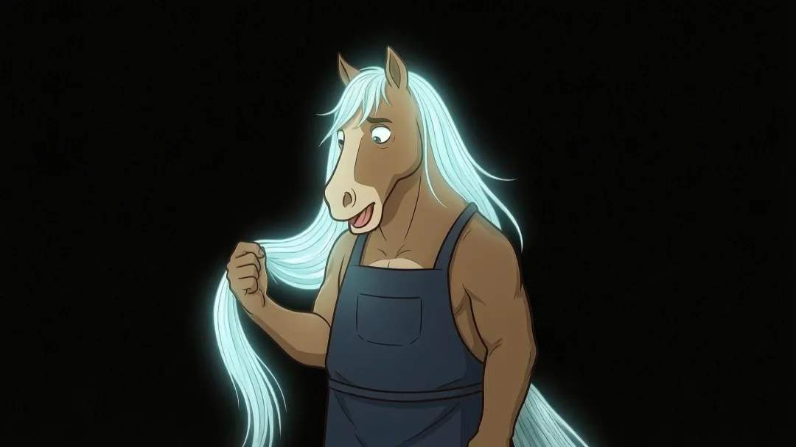
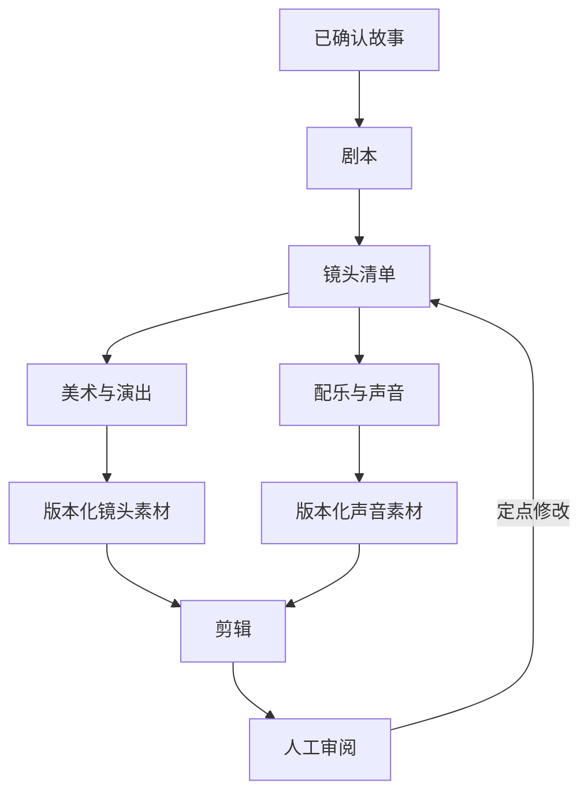

## 场景与成果

拍一部片包含剧本、分镜、美术、表演、配乐和剪辑，不是让一个模型连续生成六段文字。马趣原 showcase 描述六个专业角色与一个协调角色通过长期会话协作，并提供协同演示和完整成片。

两段视频承担不同证据：协同视频用于理解工作如何分配，成片用于观察最终叙事与视听效果。下文围绕素材交接和版本一致性展开，不把成片本身当作所有中间步骤已经自动完成的证明。

原 showcase 成片画面；可结合本页视频查看镜头与完整成片。来源：原 showcase 素材。

## 实现思路

### 专业会话之间交换产物，而不是全部聊天

长期会话保留各自上下文，但其他角色不需要读取其中所有讨论。协调者可以传递已确认剧本、镜头清单和产物引用，让专业角色基于稳定输入工作；未确认的想法仍留在讨论中，避免被误当作制作指令。

当某个镜头重做，更新它的产物版本，并通知依赖这个镜头的剪辑或声音任务。这样并行工作有明确的同步点。下图根据原资料中的角色分工组织依赖，不代表实际运行日志。

### 先形成可确认的剧本，再并行制作

编剧需要交出故事结构、角色、场景和关键对白，分镜将其变成镜头清单。剧本没有稳定之前就同时生成全部素材，后续一次角色调整可能使大量工作作废。

并行适合已经明确输入的镜头或专业任务。协调角色维护公共约束和当前版本，而不必替每个专业角色做细节判断。

### 每个镜头需要明确的素材交接单

交接单包含镜头标识、剧本版本、角色形象、场景、动作、时长目标、声音要求和产物引用。美术、演出与配乐据此工作，剪辑才能知道每份素材属于哪个镜头。

“文件已经生成”只是存在性检查。还要核对文件可用、对应版本正确，以及视觉或声音内容满足镜头要求。

### 一次剧本变更如何影响素材

合成演练中剧本已确认 v2，但镜头 s01 仍使用 v1 素材。进入剪辑前先标记它待复核。若对白变化但画面可复用，可能只需重做声音；若角色动作变化，画面也需要重做。

按影响范围决定复用，而不是整片重做或无条件接受旧素材。每次决定保留理由，方便后续解释制作取舍。

### 用成片验收跨镜头一致性

单个镜头好看，不代表连续观看流畅。成片检查应关注角色一致性、场景衔接、对白与画面同步、音乐转场和节奏。专业角色的局部成功必须在整体观看中重新验证。

人类最终审核决定故事是否成立以及哪些取舍可以接受。将修改意见绑定到镜头和版本，才能让下一轮制作聚焦到具体位置。

### 剧本改为 v2 后的素材检查

下面按具体状态展开合成演练，便于逐项核对；不代表原系统的生产运行记录。

| 项目 | 证据或条件 | 对应判断 |
|---|---|---|
| 对白 | 文字发生变化 | 重做或复核声音 |
| 动作 | 角色动作改变 | 检查画面是否仍可用 |
| 配乐 | 镜头时长改变 | 重新核对节奏 |
| 剪辑 | 混有旧版镜头 | 先确认版本再成片 |

## 复用建议

从一个短场景和少量镜头开始，完成剧本确认、素材交接、剪辑、观看与修订。分别查看本页协同视频和成片，评价分工是否减少返工、结果是否可追溯，而不是只统计启动了多少个 Agent。
