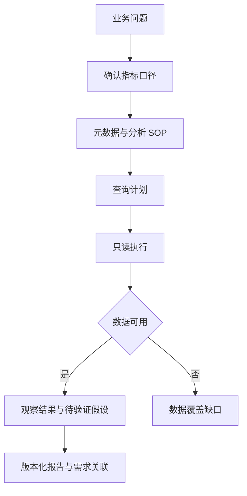

## 场景与成果

数据分析请求通常从“最近转化为什么变差了”开始。回答这个问题，需要先弄清业务口径、找到表和关联关系，再执行查询、解释差异，最终把报告交回需求方。只会生成 SQL 的助手无法独立完成整条链路。

权栩提供的 Marlin 原案例把问口径、写 SQL、问数、数据分析和实验报告作为五类持续迭代的能力。原资料还说明了按业务域组织表元数据和分析 SOP、本地 Skill 与远程 MCP 知识通道，以及用户确认后的需求流转和报告回填。下面围绕这些实际分工展开；合成数字只用于解释方法，不作为业务实绩。

根据本文案例绘制的结果示意，使用合成数据，非产品截图。缺少渠道与实验信息，不能直接归因于产品改动

## 实现思路

### 把知识与查询放到不同的检查点

一种可复用的编排方式是先固定口径与计划，再执行查询，最后依据结果写报告。知识检索可能需要补问，查询可能没有数据，报告也可能缺少解释依据，因此各阶段不能共用一个成功标记。下图根据原案例的能力分工整理，不代表未公开的内部接口。

计划中应明确每张结果表用于回答哪个子问题。若只需要比较两个周期，先取得可比的总量，再决定是否展开分组，避免一次发出许多没有明确用途的查询。报告阶段只引用已经返回的结果；查询尚在运行时，可以显示进度，但不能提前填写数值。

### 先问口径，再选择分析路径

“转化”可能指注册、下单或支付；“新用户”可能按注册日或首次访问日划分。先把分子、分母、观察窗口、去重实体和时区写进任务。若业务方说的是支付，默认 SOP 却统计下单，查询即使运行成功也回答了另一个问题。

原案例把问口径作为独立能力，这使补问成为工作的一部分，而非错误。确认单应该足够短，让需求方能直接指出口径是否正确。

### 元数据和 SOP 分别解决什么

表元数据说明数据在哪里、字段是什么、怎样关联；分析 SOP 说明为回答某类问题应该采用什么步骤。只有表说明，Agent 容易得到局部数字却没有分析路径；只有方法，执行器又不知道如何落到真实数据。

原案例同时使用本地 Skill 与远程 MCP 知识通道。复用时应让两条通道产出的指标定义和分析计划可比较，并记录实际采用的知识版本。两条通道给出不同口径时，先解决冲突，不能把结果平均一下。

### 从查询结果到报告，保留三层结论

用合成数据演练：周期 A 有 100 名符合条件的用户、20 人转化；周期 B 同样有 100 人、15 人转化。观察是 20% 降至 15%，下降 5 个百分点，相对下降 25%。这两个数含义不同，报告必须说明单位。

输入没有渠道、用户结构和实验分组，所以不能断言某次发布造成下降。下一步可以按已存在且可比的维度分组，检查变化集中在哪里；分组差异仍是线索，因果解释还需要更强证据。

### 报告交付不是发送一段结论

交付包应包含问题与确认口径、查询版本、结果表、结论、未解决问题和报告链接。需求流程引用这份报告，而不是复制一段可能失去上下文的聊天摘要。

原材料将用户确认、需求状态流转和报告回填连接起来。接入自己的系统时，要用稳定的需求标识关联执行和产物。查询成功但报告回填失败，应重试交付；口径修改则需要重新执行受影响的查询。

### 一次转化分析的交付包

下面按具体状态展开合成演练，便于逐项核对；不代表原系统的生产运行记录。

| 项目 | 证据或条件 | 对应判断 |
|---|---|---|
| 确认口径 | 同一资格用户、同一观察窗口 | 避免两期不可比 |
| 查询结果 | 20/100 与 15/100 | 保留分子分母 |
| 变化解释 | 下降 5 个百分点，相对下降 25% | 不混淆两种指标 |
| 后续调查 | 渠道与用户分组数据尚缺 | 原因保持待验证 |

## 复用建议

先选择一类有人工参考答案的问题，同时准备口径冲突、空结果和不完整周期。分别评价取数是否正确、解释是否超出证据和报告是否可复现。原资料中的业务覆盖与交付规模属于作者报告，不能替代当前版本的质量评测。
