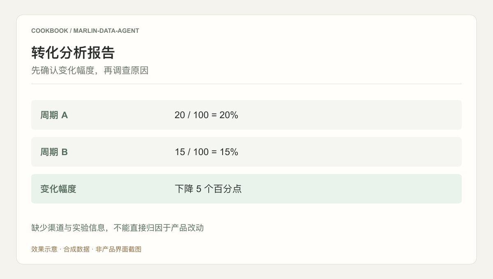

## 场景与成果

业务方提出一个数据问题后，分析人员通常先问清指标口径，再找表、写查询、解释结果并交付报告。Marlin 把这条工作链组织为持续可用的数据服务。

围绕指标口径、SQL、问数、分析和实验报告组织数据服务，以知识和流程支持可复用的分析交付。

本文根据权栩提供的 showcase 资料整理。流程图与分工表用于解释案例中的方法；后面的具体示例是复用建议，不作为生产运行的实测结论。

### 效果预览



根据本文案例绘制的结果示意，使用合成数据，非产品截图。缺少渠道与实验信息，不能直接归因于产品改动

## 实现思路

### 一次任务如何流经产品

案例材料将表元数据与分析方法库作为知识底座，并把分析结果接回需求流程。可复用的关键是口径、查询、证据和报告之间的关联。


每个环节都需要把自己的输入与结果交给下一步。后续步骤据此继续工作，用户也能沿着这条链查看结果从哪里产生、在哪一步需要确认。

### 角色分工与权威事实

| 组成部分 | 在案例中的职责 |
|---|---|
| 知识层 | 表元数据、指标定义与方法 |
| Agent | 形成查询与分析说明 |
| 数据工具 | 执行查询并保存结果 |

分析报告的可复现性依赖数据版本与口径，不取决于报告长度。知识检索负责找到方法，查询工具负责提供事实，模型负责解释事实的适用范围。

### 沿着一个具体任务展开

用合成事件表回答“新用户转化率为何下降”，最终交付一份包含指标定义、查询结果和证据限制的分析报告。

1. **先问口径**：明确新用户定义、转化事件、去重实体和时区，记录分母与分子的计算方式。
2. **选择数据**：从元数据与方法库获取表关系及分析流程，先校验权限和时间范围。
3. **执行分析**：生成只读查询并检查扫描范围，执行后保存 SQL 版本、结果表和分组对比。
4. **交付报告**：将观察、解释假设和后续实验分开，附查询依据，并让需求流程引用最终报告。

这条流程的交付物需要保留过程中使用的依据。某一步缺少数据或执行失败时，应让状态继续可见，避免后续环节把它当作已经完成的结果。

### 让结果可以被核对

下面用一组合成数据说明预期交付。它是应用侧的说明样例，不是 QCA API 请求，也不是生产记录。

```json
{
  "input": {
    "period_a": {
      "eligible": 100,
      "converted": 20
    },
    "period_b": {
      "eligible": 100,
      "converted": 15
    }
  },
  "expected": {
    "conversion_a": 0.2,
    "conversion_b": 0.15,
    "difference_percentage_points": -5
  }
}
```

预期报告只能确认转化率下降五个百分点。输入没有渠道、用户构成或实验数据，不能据此声称某次产品改动导致下降。

## 复用建议

落地时可以先复现上面的一个任务，用已知输入核对交付结果，再补齐下面这些失败或歧义场景。通过后再扩大任务范围。

| 失败或歧义场景 | 需要保留的行为 |
|---|---|
| 用户口径与默认口径冲突 | 确认定义后再执行查询。 |
| 结果表为空 | 说明无数据，不生成趋势结论。 |
| 相关性被解释成因果 | 标记假设并提出可验证实验。 |