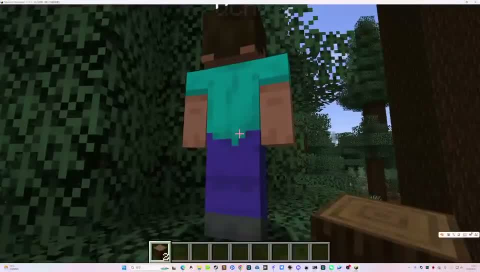
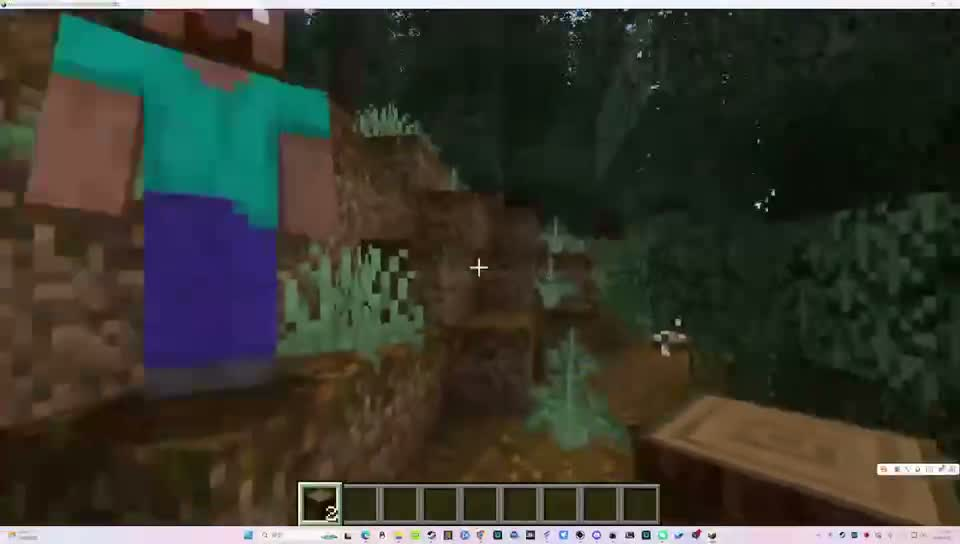
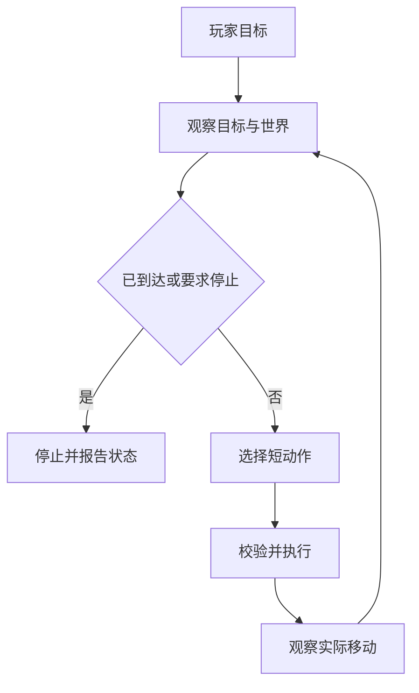

## 场景与成果

Minecraft 案例把 Agent 放进玩家所在的游戏世界，以具象化角色持续互动。原 showcase 提供演示视频，能看到 Agent 不再只是聊天窗口，而是场景中的一个角色。

视频可以展示外观和互动，但不能独自证明寻路算法或控制协议。下面以“靠近玩家并停下”为参考任务，拆解具身交互必须连接的观察、行动和反馈。

原演示画面：Agent 以游戏角色出现在玩家所在的世界。来源：原 showcase 素材。

### 原始视频关键画面

00:12：玩家视角中的 Agent 角色，周围树木、地形和物品栏均来自原演示。

00:32：同一段演示的后续画面，展示角色与玩家仍处于同一个可见场景。

以上均从原视频直接取帧，没有重绘界面。可在页首视频中定位相应时间，查看前后过程。

## 实现思路

### 把世界控制放在可限制的动作接口后

模型不需要直接控制每一帧，而可以选择由动作层执行的短操作。动作层负责检查当前任务是否仍有效、玩家是否已要求停止，以及动作参数是否在允许范围内；执行结果返回实际观察，而不只是请求已收到。

这让语言理解、动作执行和游戏状态各自可测试。即使模型重复提出旧动作，动作层仍可依据任务状态拒绝。下面是参考控制循环；演示视频没有开放具体实现，因此不能据此指定它使用了哪种寻路库。

### 语言目标要变成可观察条件

“过来陪我”需要确定目标玩家、允许距离和结束条件。示例约定进入目标两格范围后停止；这个阈值只是演练规则。若目标会移动，不能只读取一次坐标后一直走向旧位置。

结果判定应使用当前世界状态，而不是 Agent 说自己到了。角色外观、台词和动作需要共同指向同一个任务。

### 每次动作之后重新观察

控制循环可以按观察目标、选择短动作、执行、再观察组织。短动作给玩家停止或重新指定目标的机会，也让环境变化及时进入下一轮决策。

如果动作接口返回受理成功，仍需核对实际位置。碰撞、路径阻塞或游戏状态变化可能使动作没有达到预期效果。

### 三种场景检查交互是否可信

先在空旷地面测试接近和停止；再增加障碍，检查是否能重新规划或报告不可达；最后在移动中让玩家改变位置或要求停下。三种情况分别验证成功、受阻和意图变化。

不可达时保留当前位置、已尝试动作和失败原因，比重复说“马上就到”更能让玩家理解。新的目标到来后，也应丢弃已经失效的动作计划。

### 观看演示时把可见效果与实现推断分开

视频适合观察角色是否出现在同一世界、对话和动作是否衔接，以及玩家能否理解它的行为。帧率、操作延迟、长时间稳定性则需要连续记录和专门测量。

复用到其他互动场景时，保留“世界状态决定结果”的原则，但不能直接把游戏中的动作权限套用到现实设备。

## 复用建议

先只开放移动与停止，保留任务开始和结束位置，再逐步加入其他动作。验收要同时核对工具响应与游戏中的实际结果。视频中的成功片段可以帮助确定体验目标，但不是全部故障场景已经通过的证据。
