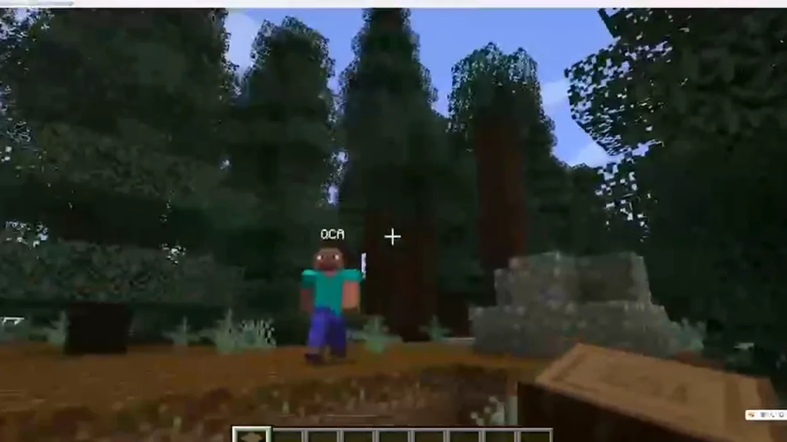
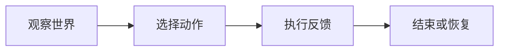

## 场景与成果

当 Agent 进入 Minecraft，玩家期待它能在同一个世界中行动，而不只是描述下一步应该怎么做。场景中的位置、障碍和玩家动作会不断改变任务上下文。

让 Agent 以游戏角色进入共享世界，通过环境感知和行动与玩家互动，探索具身陪伴的产品形态。

本文根据残风提供的 showcase 资料整理。流程图与分工表用于解释案例中的方法；后面的具体示例是复用建议，不作为生产运行的实测结论。

### 效果预览



原演示画面：Agent 以游戏角色出现在玩家所在的世界。来源：原 showcase 素材。

## 实现思路

### 一次任务如何流经产品

原 showcase 以视频呈现游戏内交互。本篇提供场景说明：任务上下文需要包含角色状态与环境变化，行动结果应回到下一轮感知。



每个环节都需要把自己的输入与结果交给下一步。后续步骤据此继续工作，用户也能沿着这条链查看结果从哪里产生、在哪一步需要确认。

### 角色分工与权威事实

| 组成部分 | 在案例中的职责 |
|---|---|
| 游戏接口 | 观察世界并执行动作 |
| Agent | 根据目标选择下一步 |
| 状态控制 | 停止、恢复与动作边界 |

实时环境会在推理期间变化。缩短动作周期并核对状态，比一次生成很长的行动计划更容易恢复；场景复杂后再增加长期目标记忆。

### 沿着一个具体任务展开

以“跟随玩家到指定区域”为最小演练，观察 Agent 如何在共享世界中根据位置变化调整动作。视频展示交互形态，以下流程用于搭建类似系统。

1. **观察世界**：读取角色位置、目标和附近障碍，只提供当前任务需要的环境信息。
2. **选择动作**：将自然语言目标转成有限动作集合，例如移动、停止和重新规划，限定动作持续时间。
3. **执行反馈**：等待游戏接口确认动作结果，遇到障碍时更新状态，而非假设角色已经到达。
4. **结束或恢复**：达到目标时停止；玩家离线、路径不可达或用户取消时返回明确状态。

这条流程的交付物需要保留过程中使用的依据。某一步缺少数据或执行失败时，应让状态继续可见，避免后续环节把它当作已经完成的结果。

### 让结果可以被核对

下面用一组合成数据说明预期交付。它是应用侧的说明样例，不是 QCA API 请求，也不是生产记录。

```json
{
  "input": {
    "target_distance": 1,
    "arrival_threshold": 2,
    "last_action": "move"
  },
  "expected": {
    "next_action": "stop",
    "goal_state": "reached"
  }
}
```

这个测试使用简化距离阈值，只验证到达后停止的状态转换。复杂地形中的路径规划仍需要独立的环境测试。

## 复用建议

落地时可以先复现上面的一个任务，用已知输入核对交付结果，再补齐下面这些失败或歧义场景。通过后再扩大任务范围。

| 失败或歧义场景 | 需要保留的行为 |
|---|---|
| 目标玩家突然移动 | 根据新位置更新计划。 |
| 路径被阻挡 | 停止无效重复动作，报告无法到达。 |
| 用户要求停止 | 停止实际动作，不只是回复已停止。 |