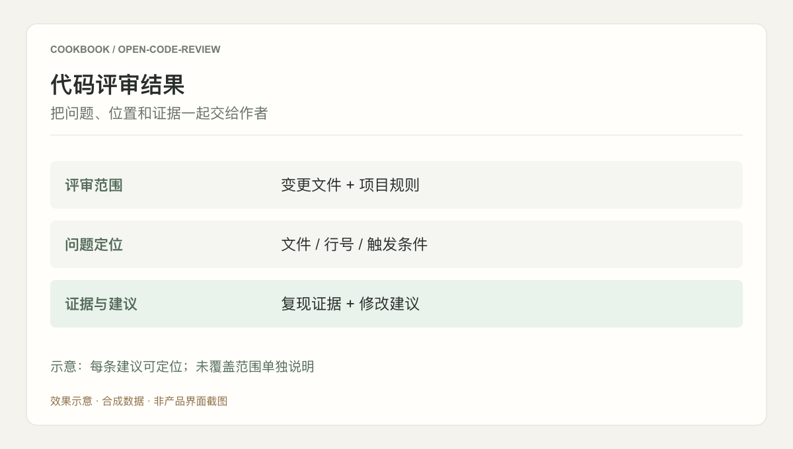
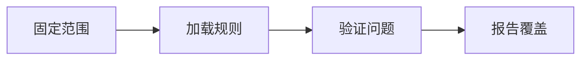

## 场景与成果

代码评审需要回答两个不同的问题：检查了哪些变更，以及哪些问题有足够证据值得修复。Open Code Review 将范围、规则和缺陷分析组织到同一条评审流程。

把评审范围、项目规则、缺陷判断和覆盖证据组合成代码评审流程，帮助审阅者核对检查结果。

本文根据曲径/安辰提供的 showcase 资料整理。流程图与分工表用于解释案例中的方法；后面的具体示例是复用建议，不作为生产运行的实测结论。

### 效果预览



根据本文案例绘制的结果示意，使用合成数据，非产品截图。示意：每条建议可定位；未覆盖范围单独说明

## 实现思路

### 一次任务如何流经产品

案例让确定性逻辑计算评审范围与规则，由模型理解代码并提出问题。只读检查与覆盖报告用于说明看过什么、遗漏什么。



每个环节都需要把自己的输入与结果交给下一步。后续步骤据此继续工作，用户也能沿着这条链查看结果从哪里产生、在哪一步需要确认。

### 角色分工与权威事实

| 组成部分 | 在案例中的职责 |
|---|---|
| 范围计算 | 提交范围与排除规则 |
| 模型 | 代码理解与缺陷判断 |
| 报告层 | 问题证据与覆盖状态 |

覆盖率与缺陷质量是两件事。全量看过仍可能误判，因此还要使用已知缺陷和无缺陷样本分别评估漏报与误报。

### 沿着一个具体任务展开

评审测试仓库中一个故意包含边界错误的变更，最终输出可定位问题及覆盖报告，而不是泛泛的代码建议。

1. **固定范围**：记录基准与目标提交，区分新增代码、上下文和排除文件。
2. **加载规则**：选择适用于本项目的规则，读取必要上下文，避免无关风格意见掩盖缺陷。
3. **验证问题**：对每个候选缺陷给出触发条件、代码位置、影响和依据，无法证实的假设不冒充确定缺陷。
4. **报告覆盖**：分别列出已检查、未覆盖和无法判断的范围，再汇总发现。

这条流程的交付物需要保留过程中使用的依据。某一步缺少数据或执行失败时，应让状态继续可见，避免后续环节把它当作已经完成的结果。

### 让结果可以被核对

下面用一组合成数据说明预期交付。它是应用侧的说明样例，不是 QCA API 请求，也不是生产记录。

```json
{
  "input": {
    "changed_files": [
      "a.py",
      "b.py"
    ],
    "reviewed_files": [
      "a.py"
    ],
    "findings": []
  },
  "expected": {
    "checked": [
      "a.py"
    ],
    "unchecked": [
      "b.py"
    ],
    "complete": false
  }
}
```

“未发现问题”必须限定到已检查范围。覆盖报告应主动暴露遗漏，而不是用一个空发现列表代表全部安全。

## 复用建议

落地时可以先复现上面的一个任务，用已知输入核对交付结果，再补齐下面这些失败或歧义场景。通过后再扩大任务范围。

| 失败或歧义场景 | 需要保留的行为 |
|---|---|
| 一个文件超过上下文限制 | 明确未覆盖范围，不报告全量完成。 |
| 同一问题多处重复出现 | 合并根因并列出影响位置。 |
| 没有发现缺陷 | 报告检查范围，不等同于代码绝对正确。 |