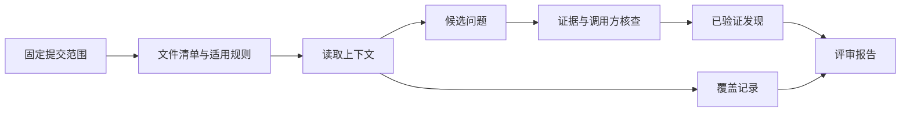

## 场景与成果

“把 Diff 发给模型”可以得到建议，却不能回答评审是否覆盖所有变更、建议是否遵循项目规则，以及每条缺陷能否复现。Open Code Review 的原 showcase 将确定性的范围和规则计算，与宿主模型的代码理解分开。

本篇围绕一次小型边界错误评审展开。原资料没有提供可对外复跑的评审任务，所以示例不代表真实项目缺陷或评审准确率。

根据本文案例绘制的结果示意，使用合成数据，非产品截图。示意：每条建议可定位；未覆盖范围单独说明

## 实现思路

### 评审流水线如何组织输入与输出

范围计算应先产生清单，再由理解阶段逐项消费。每个文件可以有已检查、排除或无法判断的状态，最终汇总时对照最初清单，才能发现漏项。模型没有提到某个文件，不能默认它已经看过。

项目规则也要带适用范围。语言风格规则不应覆盖业务正确性，某个目录的特殊约定不应自动扩散到全仓库。下面的参考流程将候选发现与覆盖记录分开汇总，使“没有发现”和“没有检查”不会混成一种结果。

### 先固定基准与目标，再读取上下文

记录基准提交和目标提交，列出变更文件、需要读取的上下文以及排除项。生成文件、依赖锁文件和业务代码的评审方式可能不同，应按项目规则决定，而不是为了减少长度随意跳过。

目标分支继续变化时，本次报告仍应绑定原目标提交。新提交是否需要补评，应另外判断，避免一份旧报告看起来像覆盖了最新版本。

### 把一个怀疑变成可复现发现

假设约定年龄必须大于等于 18，但测试代码写成 age > 18。触发输入为 18，期望接受，实际拒绝。发现应包含规则来源、代码位置、触发条件和影响，而不只是“可能存在边界问题”。

还要读取调用方：如果上游已经做了特殊处理，局部表达式未必造成用户可见缺陷。缺少上下文时，可以保留待确认问题，但不应提升为确定缺陷。

### 覆盖报告和发现列表分开

两个文件发生变更，只读完其中一个，即使没有发现问题，也只能报告部分完成。覆盖报告应列已检查、未检查、排除及无法判断的范围，并解释原因。

多处相同缺陷可以合并根因、保留各自位置，但不能因此把未读取的其他位置算作已检查。评审长度和覆盖程度也不是同一个指标。

### 验证修改与评估评审器

修复边界表达式后，验证 17、18、19 三个输入；只测试 18 可能掩盖其他行为。随后保留一个本来正确的对照变更，观察评审器是否仍生成同类误报。

已知缺陷样本用于检查漏报，正常样本用于检查误报。两者要分别看；“这次找到了一个 bug”不能说明系统适合自动作为质量门禁。

### 一条可核对的边界缺陷报告

下面按具体状态展开合成演练，便于逐项核对；不代表原系统的生产运行记录。

| 项目 | 证据或条件 | 对应判断 |
|---|---|---|
| 规则 | 年龄至少为 18 | 来源于确认的需求 |
| 触发 | 输入 18 | 覆盖等号边界 |
| 表现 | age > 18 导致拒绝 | 核对调用方是否改变影响 |
| 验证 | 修复后检查 17、18、19 | 正常与异常都保留 |

## 复用建议

先选择范围小、规则清楚的测试仓库，保留报告与提交的对应关系。再模拟上下文不足、大文件截断和读取失败，确认系统会报告覆盖缺口。只读评审的交付是可核对发现与覆盖事实，修改或合并属于后续独立任务。
