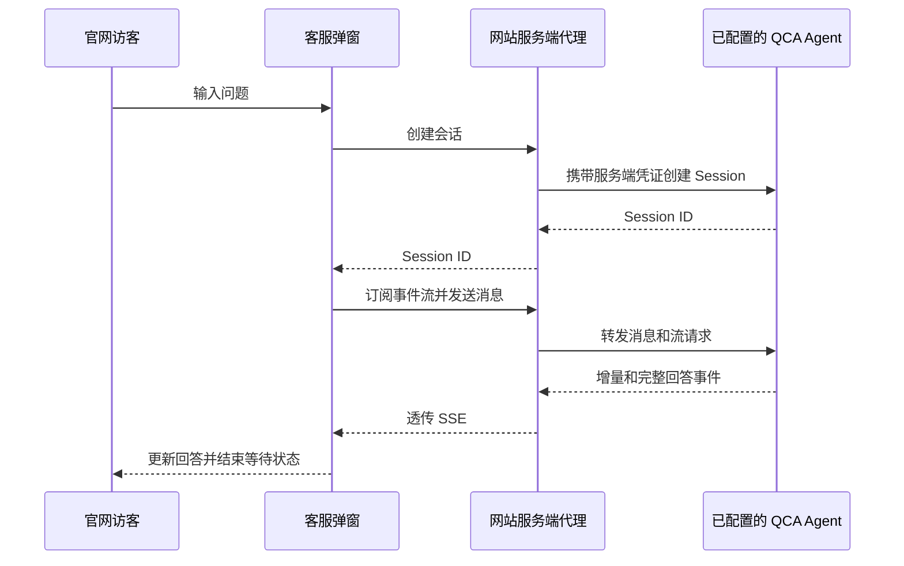

## 场景与成果

企业官网已经有产品、技术和品牌页面，访客仍需要自己寻找答案。给网站增加一个知识库助手，难点不仅在于生成回答，还在于把一次对话可靠地接进既有页面：令牌放在哪里、上下文如何保持、回答如何逐步显示、断线后怎么办。

[portal-rag-assistant](https://github.com/kunlun322/portal-rag-assistant) 是 kunlun322 公开的官网客服项目。在品牌演示站中，四个页面共用客服弹窗，由网站服务端代理访问预先配置的 Qoder Cloud Agents 问答 Agent。项目同时提供本地 Node.js 服务和 Vercel 函数入口。

本篇是对公开实现的整理，代码核对版本为 `eb1afef05af0565231e16e4bb3a6fc9da8d402b2`。可确认的成果是完整的网站集成代码，而不是某家汽车企业的正式上线背书；未进行带真实凭证的问答评测，也没有可引用的准确率、客服替代率或成本收益数据。

值得复用的是三个清晰的边界：

| 边界 | 公开实现中的职责 |
|---|---|
| 浏览器 | 收集问题、维护当前对话状态、呈现回答 |
| 网站服务端 | 从环境变量读取凭证、代理会话与消息请求、透传事件流 |
| 已配置的 QCA Agent | 承接问答任务；知识和 Agent 配置由接入方准备 |

### 效果预览

门户演示首页：右下角的在线客服承接产品问答。来源：原 showcase 素材。

## 实现思路

### 用一个小代理连接网站与 Agent

客户端只访问网站自己的三个接口：`/api/chat/session`、`/api/chat/message` 和 `/api/chat/stream`。服务端从环境变量读取 PAT，并在请求 Qoder 时加入认证头。这样前端不需要知道 PAT，也不用直接调用需要认证的 Qoder API。

公开版本的代理使用 Forward 会话接口及 Identity、Template 配置。它展示的是这个版本的集成方式；接入新项目时，应核对当前 API 契约，不能把这些字段直接替换成 Managed Mode 的 Agent、Environment 字段。

以下图示根据公开代理与客户端代码整理：

创建会话后，客户端调用建立事件流的函数，再发送消息。这是代码调用顺序，不等于已经等待流连接就绪；生产接入需要单独验证首轮消息不会因为订阅时序而丢失。

### 增量展示与最终文本分别处理

客户端没有把所有 SSE 帧都当作普通字符串：

- `event_delta` 到达时追加回答片段，让访客看到进度。
- `agent.message` 到达时用完整文本校正当前回答，避免只依赖片段拼接。
- `session.status_idle` 到达时结束忙碌状态；如果没有回答，显示错误而不是空白成功。

这里有一个具体的实现细节：代码注释指出，同一轮的增量帧可能共享事件 ID。因此客户端对离散事件按 ID 去重，却不对所有增量帧一律按 ID 去重。这个处理值得关注，但不应当被理解为跨任意断线场景的“恰好一次”保证。

### 连接恢复与页面渲染都有收尾

浏览器使用 `EventSource`，代理转发 `Last-Event-ID`，为断线续传提供机制；客户端还有无事件超时处理，避免一直显示正在回答。最终是否恢复完整回答，仍需要通过断网、重连、超时等验收场景确认。

回答经过 Markdown 渲染后，客户端使用元素和属性白名单清理输出。复用时应把这层处理视为必要的展示边界，不能因为文本来自 Agent 就直接信任其中的 HTML。

## 复用建议

先用一个范围很窄的知识集合验证链路，例如产品规格和常见服务问题。知识准备、检索质量和网站集成是不同的工作：这个仓库没有提供可独立复现的知识索引构建流程，不能仅凭客服弹窗正常显示就认定 RAG 效果已达标。

建议按下面的顺序验收。表格是针对复用者设计的检查项，并非本案例已经完成的测试报告。

| 检查 | 应观察到的结果 |
|---|---|
| 询问知识库明确覆盖的问题 | 回答与已知材料一致；需要引用的产品要求有来源支撑 |
| 询问材料未覆盖的问题 | 明确说明未知，或引导人工咨询，不补造承诺 |
| 连续追问 | 当前会话保持语境，不串到其他访客 |
| 中途断开连接再恢复 | 回答不会永久停在半句，错误状态可理解 |
| 检查浏览器请求与静态资源 | 不包含服务端 PAT |
| 提交带恶意链接或 HTML 的内容 | 渲染结果不执行脚本或保留危险属性 |

面向公网接入前，还需要为代理补齐调用方身份、会话归属校验、限流和用量控制。在所核对的共享代理文件中，没有看到这些控制；“PAT 不下发”不等于已经具备完整的多租户隔离。不要直接把一个可调用任意传入 Session ID 的代理当成生产网关。

本文没有复制第三方源码和图片。复用代码或品牌素材前，应核对原仓库的许可和素材授权；公开可读不自动等于可按本 Cookbook 的许可证再分发。

## 参考实现

- [项目说明与启动方式](https://github.com/kunlun322/portal-rag-assistant)
- [固定版本：服务端代理](https://github.com/kunlun322/portal-rag-assistant/blob/eb1afef05af0565231e16e4bb3a6fc9da8d402b2/lib/qoder.js)
- [固定版本：客服客户端](https://github.com/kunlun322/portal-rag-assistant/blob/eb1afef05af0565231e16e4bb3a6fc9da8d402b2/customer-service.js)

### 复用时核对交付边界

事件流协议与最终消息应有明确优先级。端到端测试需要核对可见文本，不只是请求是否返回成功。

| 检查点 | 预期行为 |
|---|---|
| 事件重放 | 文字不重复。 |
| 代理返回错误 | 停止等待并显示可理解错误。 |
| 恶意消息内容 | 渲染为安全文本或受控格式。 |

