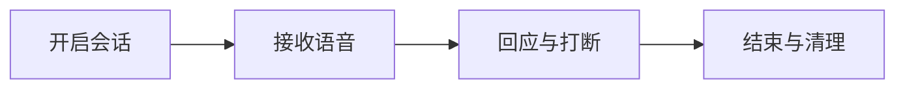

## 场景与成果

实时陪伴发生在说话与倾听之间：用户会停顿、插话，也会主动结束会话。星语把这些交互放在语音产品里，让对话控制与回应内容一样可见。

[打开在线入口](https://qca-realtime-agent.vercel.app/)

以实时语音承接分享与提问，在持续对话中提供陪伴体验，并向使用者展示隐私与安全边界。

本文根据Qoder Agents 团队提供的 showcase 资料整理。流程图与分工表用于解释案例中的方法；后面的具体示例是复用建议，不作为生产运行的实测结论。

### 效果预览


实时陪伴入口：选择话题后开始语音交流。来源：原 showcase 素材。

## 实现思路

### 一次任务如何流经产品

案例围绕实时语音和多轮对话组织界面。体验重点包括倾听、回应、轮次衔接以及用户主动结束对话的入口。



每个环节都需要把自己的输入与结果交给下一步。后续步骤据此继续工作，用户也能沿着这条链查看结果从哪里产生、在哪一步需要确认。

### 角色分工与权威事实

| 组成部分 | 在案例中的职责 |
|---|---|
| 语音界面 | 麦克风、播放和结束入口 |
| Agent | 理解语音并组织回应 |
| 会话控制 | 轮次、取消与数据处理 |

陪伴体验依赖轮次和控制感，不只是回应是否流畅。先把停止、打断与重连做清楚，再增加长期记忆；记忆应有明确的查看与删除方式。

### 沿着一个具体任务展开

用成年人测试账号模拟“分享今天发生的一件事”，检查倾听、回应、打断和结束会话的完整体验，不使用真实儿童语音。

1. **开启会话**：明确麦克风状态、用途和结束入口，用户操作后才开始采集。
2. **接收语音**：管理说话轮次与静音，显示正在听或正在处理，避免把网络延迟误当作无人响应。
3. **回应与打断**：播放回应时允许用户打断，取消旧轮次的待播放内容，防止多条回应叠加。
4. **结束与清理**：停止采集和播放，按产品规则处理会话数据，明确会话已关闭。

这条流程的交付物需要保留过程中使用的依据。某一步缺少数据或执行失败时，应让状态继续可见，避免后续环节把它当作已经完成的结果。

### 让结果可以被核对

下面用一组合成数据说明预期交付。它是应用侧的说明样例，不是 QCA API 请求，也不是生产记录。

```json
{
  "input": {
    "playing_turn": "t1",
    "new_user_turn": "t2"
  },
  "expected": {
    "cancel_playback": "t1",
    "active_turn": "t2"
  }
}
```

语音内容是否合适与轮次状态是否正确需要分开检查。本例先确保不会同时播放两个轮次，也不会把旧回应追加到新问题。

## 复用建议

落地时可以先复现上面的一个任务，用已知输入核对交付结果，再补齐下面这些失败或歧义场景。通过后再扩大任务范围。

| 失败或歧义场景 | 需要保留的行为 |
|---|---|
| 回应期间用户插话 | 旧回应停止，新轮次不混入旧内容。 |
| 网络中断 | 展示断线状态并停止无限等待。 |
| 点击结束后继续说话 | 不再采集或产生新回应。 |