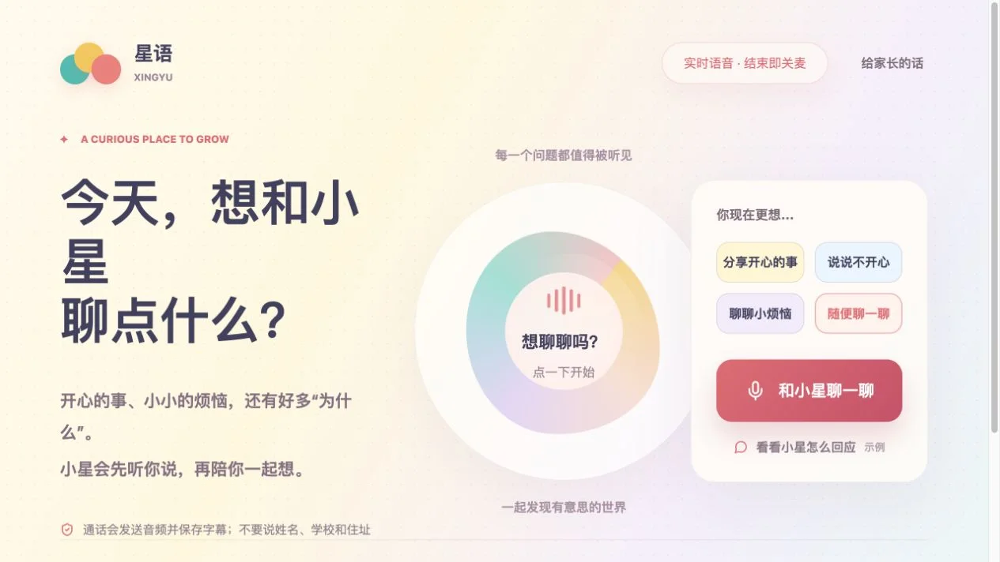
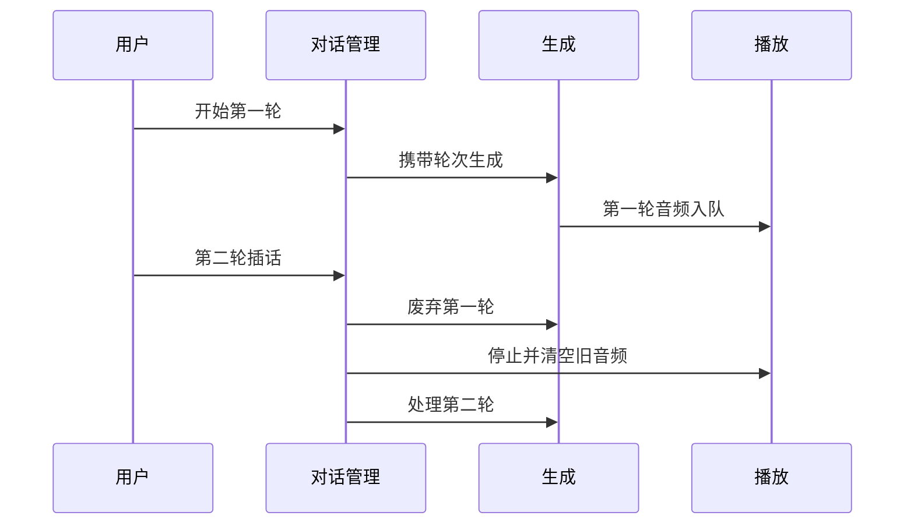

## 场景与成果

星语将实时语音包装成亲子陪伴入口，提供分享开心、烦恼和好奇问题等话题。原公开界面同时向家长说明输入与隐私边界，降低第一次开口的门槛。

这类产品的体验由倾听、回应、插话和结束共同决定，不是只看回复内容。下文讨论一轮对话的交互契约；公开入口不能证明后端使用何种语音模型或完整安全机制。

实时陪伴入口：选择话题后开始语音交流。来源：原 showcase 素材。

## 实现思路

### 同一轮次贯穿输入、文本与音频

语音链路会同时存在输入事件、文本片段和音频片段，它们的到达顺序未必一致。对话管理应让这些片段归属明确轮次；当新轮替代旧轮时，各消费者都按同一个有效轮次决定是否继续处理。

错误也要落到用户理解的阶段：没有麦克风输入、服务未响应和音频播放失败，不应统一显示“没听清”。这个参考时序强调插话后的废弃操作，具体语音协议仍取决于所接服务。

### 开始之前让用户知道当前状态

话题卡片帮助表达意图，但麦克风尚未开启时不能显示正在倾听。连接建立、权限允许和音频输入实际开始是不同步骤，失败时需要可理解的提示。

用文字和可见状态说明正在倾听、正在思考、正在播放或已经结束。不要只靠一段持续动画，让用户猜设备是否还在收音。

### 插话需要同时处理生成与播放

第一轮回答开始播放后，用户提出第二个问题。系统需要停止旧音频、清除待播队列，并让字幕和回答归属新轮次。仅取消模型生成，已经缓存的音频仍可能继续播放。

轮次标识可以帮助拒绝迟到的旧结果。旧轮文本不应接在新问题下，旧轮音频也不应在新回答中间突然响起。

### 陪伴回答要给用户继续表达的空间

可以用短回应确认听到的问题，再给一个具体且容易回答的追问。一次很长的建议容易占满语音通道，也增加插话成本。评估时看用户是否有机会继续说，而不是只统计回答字数。

对名字、住址等个人信息的提醒应在使用入口清楚可见。不能因为页面出现提醒，就推断后台没有留存或已实现所有保护；这些需要独立核对。

### 结束应真正结束输入与输出

用户选择结束后，应停止本轮收音、播放和未完成请求。若网络断开，应让用户知道是否需要重新开始，而不是在恢复后自动播放旧回答。

测试时分别在倾听、思考和播放阶段结束，确认三个阶段都能收尾。只有正常播放结束后的关闭测试，覆盖不了中途退出。

## 复用建议

用简短测试话题检查首轮连接、插话、静音、断网和结束。记录实际状态转换与可听结果，并邀请真实目标用户评估可理解性。不要把“能说话”直接等同于适合长期陪伴。
