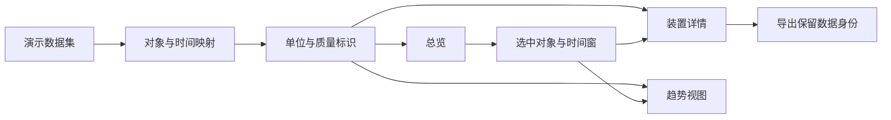

## 场景与成果

炼厂驾驶舱把装置负荷、物料流、趋势和安环信息放到一个全局视图中。原公开演示采用流程工业语境，展示用户如何从总览进入具体对象的阅读过程。

本例的运行读数是演示数据，不代表生产接入。它适合研究领域信息如何呈现和关联，而不能作为实际装置运行状态、工艺判断或告警处置依据。

驾驶舱演示界面：装置负荷与物料流。画面中的运行读数为演示数据。来源：原 showcase 素材。

## 实现思路

### 数据适配层决定界面是否可信

行业界面通常需要把多个来源转成可比较的对象。适配层应统一对象标识和时间表达，同时保留原单位、质量标识与采样窗口。不要为了让图连起来就对缺失值随意插补；确需补值时，要在结果上保留该身份。

可视化只呈现这些事实与关系，模型若参与说明，应引用选中的对象和窗口。下面展示从数据身份到视图的参考分工，不表示当前演示已连接真实采集系统。

### 先建立阅读顺序，再增加指标

总览先回答哪些对象值得关注，再让用户追到装置、上下游和时间变化。把所有指标做成同样大的数字，会失去优先级；仅有高亮颜色又难以解释为什么需要关注。

每个指标应保留单位、所属对象、时间窗和数据身份。页面中的静态背景信息与动态演示读数也应区分，避免被当作同一采样时刻的数据。

### 沿一条物料路径阅读关系

从原料入口沿连线找到处理装置和产品出口，核对节点与边分别表示什么。装置负荷百分比和物料流量不是同一种量，不能直接相加或拿高低判断效率。

如果界面展示多个时间窗口，应明确哪些值可以比较。数据缺失时显示缺口，比用零或上一时刻数值静默替代更可靠。

### 从总览到详情保留上下文

用户选择一个装置后，详情应继续显示装置身份、时间范围和相关上下游。返回总览时保留刚才的选择，才不必重新找位置。

演示数据身份应随详情和导出一起保留。只在首页页脚写一次“模拟”，截图或报告离开页面后就容易失去关键背景。

### 告警展示需要说明状态与依据

一个彩色告警标记至少需要解释对象、触发时间、规则或阈值、当前是否仍有效。没有这些上下文，用户无法判断它是新问题、历史记录还是演示动画。

本案例不提供生产处置建议。复用界面结构时，应由领域系统提供经过确认的告警规则，不能把模型描述直接作为自动控制指令。

## 复用建议

用一条物料路径和一个装置验证阅读闭环，再增加更多视图。分别检查单位、时间窗、选择联动、缺失数据和导出标识。验收目标是信息可理解、可追踪，不是大屏上的指标越多越好。
