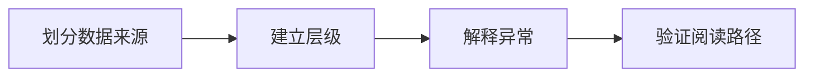

## 场景与成果

炼厂总览需要把装置、物料流、趋势和告警放在一张可阅读的界面里。这个演示用驾驶舱表达信息层级，让观察者从全局变化进入具体指标。

[打开在线入口](https://hao2-lzsh-refinery.vercel.app)

以装置负荷、物料流、趋势和安环提示组织炼厂驾驶舱，展示流程工业信息的可视化方式。

本文根据何傲提供的 showcase 资料整理。流程图与分工表用于解释案例中的方法；后面的具体示例是复用建议，不作为生产运行的实测结论。

## 实现思路

### 一次任务如何流经产品

公开页面明确标注运行参数为演示态，并以公开披露的产能与数字化指标提供背景。它适合作为界面与信息架构案例，不作为实时生产接入证据。



每个环节都需要把自己的输入与结果交给下一步。后续步骤据此继续工作，用户也能沿着这条链查看结果从哪里产生、在哪一步需要确认。

### 角色分工与权威事实

| 组成部分 | 在案例中的职责 |
|---|---|
| 数据层 | 指标来源、单位与时间 |
| 驾驶舱 | 总览、趋势与详情 |
| 解释层 | 告警依据与数据身份 |

本例已知是演示驾驶舱，丰富页面不等于接入真实生产。若增加 Agent 解释，应把模拟数据身份一并传递，防止报告被误读为生产结论。

### 沿着一个具体任务展开

以演示数据查看某装置负荷变化，从总览定位装置，再核对趋势与告警时间，训练对数据口径的可视化表达。

1. **划分数据来源**：区分公开背景指标、模拟运行值和未来真实接入值，每种显示来源及时间。
2. **建立层级**：总览回答哪里异常，装置视图回答何时变化，详情展示具体指标和单位。
3. **解释异常**：告警需要阈值、时间窗口和关联数据，避免只靠颜色表达风险。
4. **验证阅读路径**：使用固定模拟事件检查总览与详情一致性，观察者应能回到原始数据。

这条流程的交付物需要保留过程中使用的依据。某一步缺少数据或执行失败时，应让状态继续可见，避免后续环节把它当作已经完成的结果。

### 让结果可以被核对

下面用一组合成数据说明预期交付。它是应用侧的说明样例，不是 QCA API 请求，也不是生产记录。

```json
{
  "input": {
    "data_mode": "simulation",
    "load_percent": 72
  },
  "expected": {
    "label": "simulated load",
    "production_claim": false
  }
}
```

同一数字必须携带数据身份。总览、详情和导出报告都应保留演示标识，不能只在页面页脚提醒一次。

## 复用建议

落地时可以先复现上面的一个任务，用已知输入核对交付结果，再补齐下面这些失败或歧义场景。通过后再扩大任务范围。

| 失败或歧义场景 | 需要保留的行为 |
|---|---|
| 数据停止更新 | 显示过期时间，不继续标为实时。 |
| 百分比与绝对量混用 | 明确单位，不合并到同一无标识刻度。 |
| 告警解除 | 保留发生与解除时间。 |