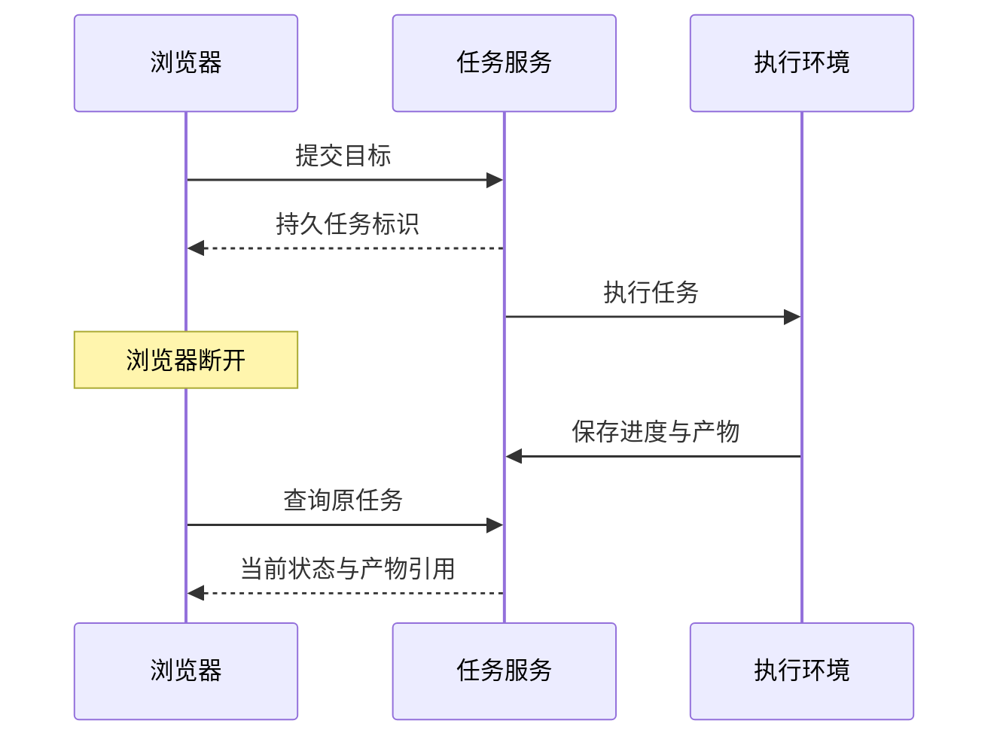

## 场景与成果

> **资料待补充。** 已保留产品入口，但尚缺公开测试任务的过程截图与最终交付文件。

Remote Agent 将云端运行能力直接变成用户产品：从网页提出目标，后台持续执行，用户稍后回来查看过程和成果。原 showcase 将它描述为不依赖本地电脑持续在线的任务入口。

这里最重要的产品问题是：关闭网页后，用户如何确认任务仍存在，回来后又如何找到同一个结果？下文用一个报告任务讨论应用应保留的事实，不把参考状态设计当作公开服务的内部实现。

## 实现思路

### 长任务界面怎样连接后台

网页可以使用事件流显示进度，但事件流只是观察渠道，任务记录才是恢复入口。重连后先取得当前快照，再补充未读事件，可以避免把客户端缓存当作当前事实。快照和事件的组合需要版本或顺序依据，否则可能出现进度回退。

在结果阶段，应把执行完成、产物归档和用户已看过区分开。用户没打开报告不等于任务没完成；下载失败也不需要重新生成整份报告。下面的时序是接入时可参考的职责划分，不是公开服务的协议。

### 提交成功必须有可重新找到的任务

用户点击发送，只表示发起请求；只有拿到任务标识，才有依据稍后查询。提交时超时且没有返回标识，需要区分未受理与已受理但响应丢失。应用若支持请求幂等标识，可以核对原请求，避免自动生成两个任务。

把任务标题、创建时间、目标和状态展示在任务入口，用户回来后才能辨认，不能只依赖浏览器内存里的聊天文本。

### 页面连接状态与任务状态分开

关闭页面、网络断开或电脑休眠，是客户端事件。任务可能继续运行、等待输入，也可能已经失败。重连后应查询原任务当前状态，而不是根据断线时的显示恢复一个假进度。

等待用户回答也需要明确提示。长期没有新输出不一定是异常；应用可以显示最近事件时间和等待原因，避免用永远转动的动画代替真实状态。

### 报告任务要交付文件和完成依据

如果请求是生成报告，完成标准至少包含报告可读、对应本次输入、输出格式符合约定。聊天里的“写好了”不能代替文件。产物还应标明生成版本和必要的使用说明。

预览失败与任务失败也要区分：文件存在但预览加载错误，应该提供可理解的产物状态；文件根本未生成，则不应把空链接呈现为完成。

### 取消、重试和继续是三个动作

取消意味着请求停止当前执行，但可能已有部分产物；重试意味着对失败步骤再执行；继续意味着沿原任务补充信息。按钮名称应反映真实效果。

用户补充新条件时，记录它影响哪些已完成结果。例如改变报告时间范围后，旧分析不能直接复用。保留修改历史能解释为什么本次报告与上次不同。

## 复用建议

实际验收时先确认任务已受理，再关闭页面重开；检查任务标识、历史和产物一致。随后测试等待输入、取消和执行失败。评价用户能否解释当前状态、找到成果，而不是只检查页面恢复后是否还能聊天。
