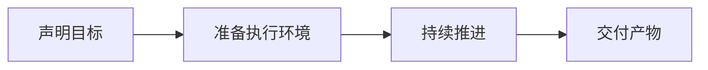

## 场景与成果

用户提交一个目标后，希望关掉本地页面也不会丢失任务。Remote Agent 将执行环境、持续状态和产物交付放到云端，并通过任务页面让用户随时回来查看。

[打开在线入口](https://qoder.com/agents/session/new)

从 Web 提交目标，让 Agent 在云端环境规划、执行并交付任务成果，减少对本地设备持续在线的依赖。

本文根据Qoder Agents 团队提供的 showcase 资料整理。流程图与分工表用于解释案例中的方法；后面的具体示例是复用建议，不作为生产运行的实测结论。

## 实现思路

### 一次任务如何流经产品

案例将云端执行能力呈现为面向使用者的任务产品。任务页面需要承载进度、执行记录和产物，而不仅是对话历史。



每个环节都需要把自己的输入与结果交给下一步。后续步骤据此继续工作，用户也能沿着这条链查看结果从哪里产生、在哪一步需要确认。

### 角色分工与权威事实

| 组成部分 | 在案例中的职责 |
|---|---|
| 任务入口 | 目标、进度与产物访问 |
| Agent 与环境 | 规划与工具执行 |
| 任务存储 | 持久状态与产物关联 |

云端持续执行需要可观察状态，而不是一直显示转圈。用户应知道任务在做什么、等待什么，以及哪里可以拿到最终产物。

### 沿着一个具体任务展开

提交一个“根据三份测试文档生成对比报告”的任务，关闭页面后重新进入，验证任务、证据和产物是否连续。

1. **声明目标**：明确输入文档、输出格式和完成条件，不让“做个分析”成为无法验收的目标。
2. **准备执行环境**：将输入放入可访问环境，记录工具和资源范围；缺少文件时停止并说明。
3. **持续推进**：任务状态独立于浏览器连接，展示正在执行、等待或失败的阶段。
4. **交付产物**：输出可下载报告及引用，重进页面仍能定位同一任务和完成结果。

这条流程的交付物需要保留过程中使用的依据。某一步缺少数据或执行失败时，应让状态继续可见，避免后续环节把它当作已经完成的结果。

### 让结果可以被核对

下面用一组合成数据说明预期交付。它是应用侧的说明样例，不是 QCA API 请求，也不是生产记录。

```json
{
  "input": {
    "task": "running",
    "browser": "disconnected"
  },
  "expected": {
    "task": "running",
    "resume_ui": "query same task"
  }
}
```

浏览器连接状态不是任务状态。页面恢复后查询原任务即可；自动重新提交目标可能产生重复任务和重复产物。

## 复用建议

落地时可以先复现上面的一个任务，用已知输入核对交付结果，再补齐下面这些失败或歧义场景。通过后再扩大任务范围。

| 失败或歧义场景 | 需要保留的行为 |
|---|---|
| 关闭浏览器 | 任务不被误标取消，重连能查询状态。 |
| 用户取消任务 | 实际执行停止或明确说明停止中。 |
| 只生成空报告文件 | 验证失败，不能只凭文件存在交付。 |