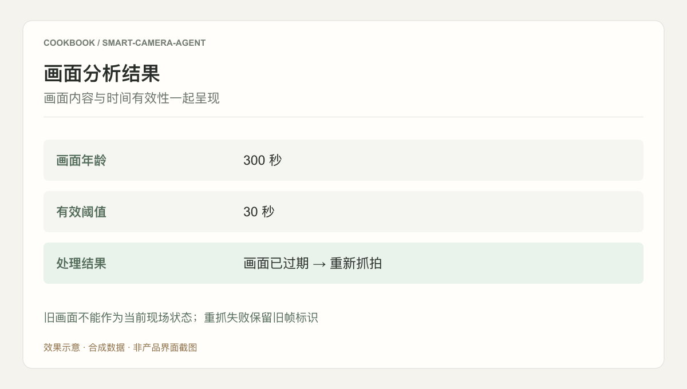
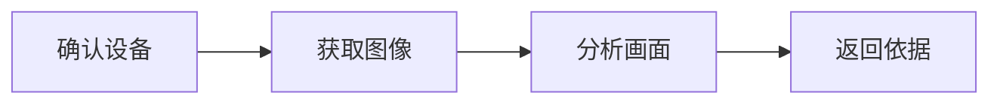

## 场景与成果

用户询问现场情况时，答案需要来自某台设备在某个时刻获取的画面。智能摄像头案例将设备能力封装成工具，再由 Agent 解释画面里的可见信息。

将摄像头连接和画面获取封装为工具能力，让 Agent 围绕实际图像执行环境观察与分析。

本文根据少狂提供的 showcase 资料整理。流程图与分工表用于解释案例中的方法；后面的具体示例是复用建议，不作为生产运行的实测结论。

### 效果预览



根据本文案例绘制的结果示意，使用合成数据，非产品截图。旧画面不能作为当前现场状态；重抓失败保留旧帧标识

## 实现思路

### 一次任务如何流经产品

原 showcase 通过视频展示 Forward 与 Skill 接入摄像头的路径：连接设备、获取画面、形成解释。设备访问与视觉理解是不同职责。



每个环节都需要把自己的输入与结果交给下一步。后续步骤据此继续工作，用户也能沿着这条链查看结果从哪里产生、在哪一步需要确认。

### 角色分工与权威事实

| 组成部分 | 在案例中的职责 |
|---|---|
| 设备工具 | 授权访问与图像获取 |
| 视觉 Agent | 根据图像回答现场问题 |
| 应用 | 时间标识与失败提示 |

摄像头接入与视觉推理应有独立错误状态。获得画面不等于看清目标，看清目标也不等于可以推断画面之外的事件。

### 沿着一个具体任务展开

使用获授权的测试摄像头回答“桌面上是否有包裹”，交付带时间戳的观察描述；演练不涉及人脸身份识别。

1. **确认设备**：将用户问题映射到明确设备，验证可用性与访问权限。
2. **获取图像**：通过工具抓取一帧，返回拍摄时间、设备标识和图像引用，失败不能回用旧帧冒充成功。
3. **分析画面**：把问题与图像交给视觉分析，区分可见事实、遮挡和低置信度判断。
4. **返回依据**：显示观察时间和结果，必要时提示重新拍摄，不将观察结论自动转换成设备动作。

这条流程的交付物需要保留过程中使用的依据。某一步缺少数据或执行失败时，应让状态继续可见，避免后续环节把它当作已经完成的结果。

### 让结果可以被核对

下面用一组合成数据说明预期交付。它是应用侧的说明样例，不是 QCA API 请求，也不是生产记录。

```json
{
  "input": {
    "frame_age_seconds": 300,
    "max_age_seconds": 30
  },
  "expected": {
    "fresh": false,
    "action": "recapture"
  }
}
```

图像清晰不等于实时。若重新获取失败，应保留“旧帧”标签，避免用户依据过期画面判断当前现场。

### 实际操作：从第一条请求开始

下面是一条可用于测试环境的复现任务，用来走通应用流程；不代表原产品未公开的内部实现。

> 分析这张测试画面，先报告拍摄时间与有效性，再描述可见事实。画面过期时重新获取；不能获取新画面时不要判断当前现场状态。

把一张清晰但五分钟前拍摄的图片送入流程，并将有效阈值设为三十秒。系统应先触发重新抓拍，而非直接生成当前现场结论。再模拟抓拍失败，检查用户看到的是带旧帧标识的观察记录，而不是伪装为实时的分析。

### 读懂结果，再试一次反例

第一轮跑通后，只改变一个条件：**镜头被遮挡**。此时应当看到的行为是：说明无法判断，不输出不存在包裹。 将前后两次结果并排保留，核对是判断发生了合理变化，还是某一步没有输出。


## 复用建议

落地时可以先复现上面的一个任务，用已知输入核对交付结果，再补齐下面这些失败或歧义场景。通过后再扩大任务范围。

| 失败或歧义场景 | 需要保留的行为 |
|---|---|
| 镜头被遮挡 | 说明无法判断，不输出不存在包裹。 |
| 图像时间过旧 | 标为历史画面或重新获取。 |
| 设备访问失败 | 返回获取失败，与模型无法识别分开。 |