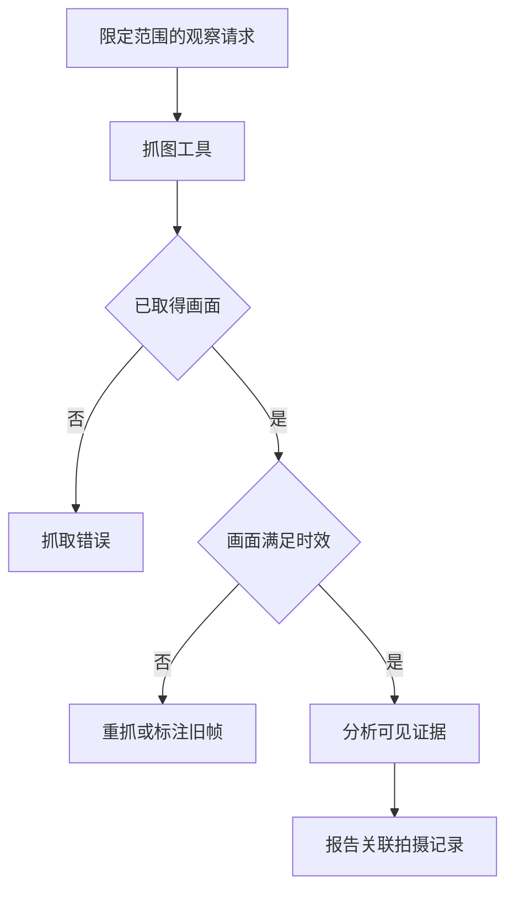

## 场景与成果

智能摄像头案例通过 QCA Forward 将既有摄像头的连接、抓图和分析能力封装为 Skill，让用户以对话提出观察任务。原 showcase 提供视频，展示从调用设备能力到形成分析结果的产品路径。

原演示截图包含设备与现场信息，不在正文直接复制。下面使用带时间约束的合成画面任务，重点解释“看到一张图”与“知道当前现场状态”之间的差别。

根据本文案例绘制的结果示意，使用合成数据，非产品截图。旧画面不能作为当前现场状态；重抓失败保留旧帧标识

## 实现思路

### 工具链的结果怎样关联到问题

一次任务可以记录请求标识、授权设备引用、拍摄时间和观察目标。分析结果绑定这次抓图，而不是只绑定文件名；同名文件被下一次抓图覆盖时，旧报告仍需要能解释自己使用的是哪张画面。

将连接和抓拍工具封装为 Skill 之后，还需要明确错误返回格式。模型看到的是结构化的成功、失败或过期信息，才能选择重试抓取或向用户说明限制。下图是参考处理关系，不是原设备 SDK 的调用协议。

### 先确定要看什么和什么时候

用户说“看一下现在的情况”，应用需要确定授权设备、观察目标和最大画面年龄。抓图结果应带拍摄时间和设备引用；只拿到一张文件，不能确认它是不是本次拍摄。

将设备选择留在授权范围内。模型理解观察任务，不应通过猜测设备标识扩大访问范围。

### 抓取、时效检查与图像理解分开

先检查抓取是否成功，再核对时间，最后分析可见内容。清晰度高不代表实时；图片模糊也不代表设备离线。这些失败原因需要不同的反馈。

演练中画面年龄为 300 秒，阈值为 30 秒，因此应重新抓拍。若重抓失败，可以展示带旧帧标识的历史观察，但不能写成当前状态。

### 观察与推断怎样写进报告

报告先写可见事实，再写不确定解释和需要人工核对的内容。单帧不能证明持续行为，画面盲区不能当作不存在目标，未观察到异常也不等于整体安全。

每条描述可以关联区域和拍摄时间。若用户追问变化，应取得可比较的新帧或序列，而不是根据一张旧图补写时间趋势。

### 失败信息也属于交付物

连接失败、抓图超时、旧帧和无法识别，应分别说明。设备离线时反复启动分析无法增加信息；图像已取得但过期时，应该回到抓取阶段。

复用者还要核对返回内容是否包含不需要的设备标识或现场细节。对外报告可以只保留完成观察所需的信息，详细设备记录留在授权排障链路。

### 从画面到观察报告

下面按具体状态展开合成演练，便于逐项核对；不代表原系统的生产运行记录。

| 项目 | 证据或条件 | 对应判断 |
|---|---|---|
| 获取 | 返回图片与拍摄时间 | 确认属于本次请求 |
| 时效 | 300 秒，阈值 30 秒 | 重抓而非直接解释当前 |
| 重抓失败 | 只有旧帧 | 标注历史观察 |
| 取得新帧 | 时间满足约定 | 分析可见内容与局限 |

## 复用建议

先测试一个授权设备、一个明确观察目标，再分别模拟过期、超时与模糊画面。验收报告能否追溯拍摄时间、是否正确表达盲区和不确定性，以及重抓后是否替换旧结果。
