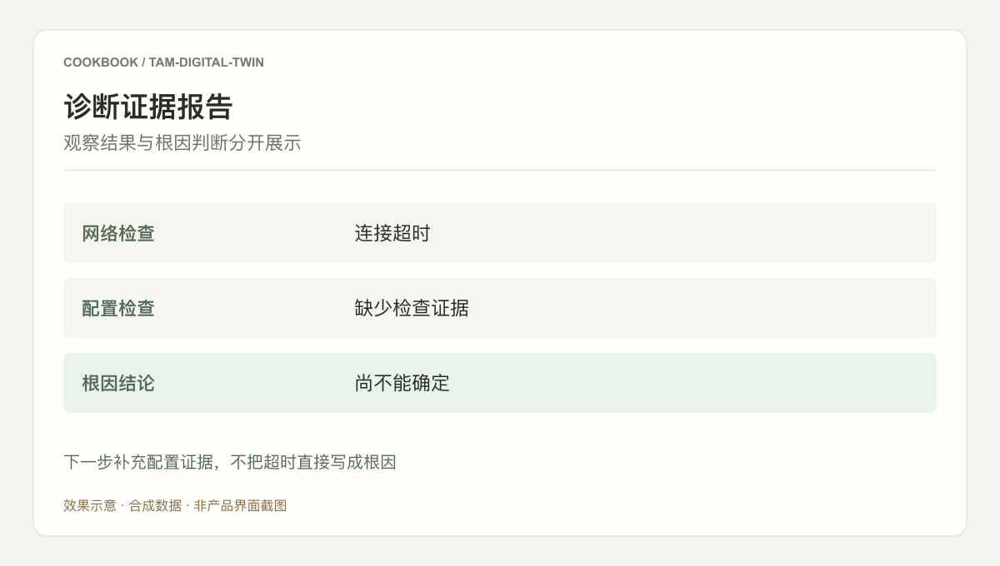
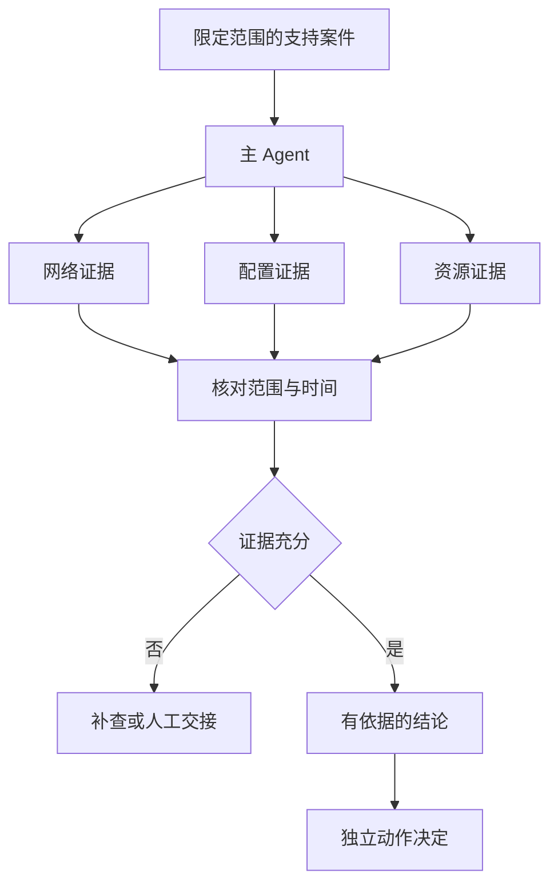

## 场景与成果

行业技术支持需要把客户描述、团队知识、配置检查与实时资源状态放在一起。问题常从群聊进入，却要跨多个专业方向排查；上下文在转交中丢失，就会反复询问同样的问题。

原 TAM 数字分身 showcase 描述一个常驻消息渠道的主 Agent，通过专项 Agent 连接知识、Skill、记忆、凭证和云资源诊断。现有材料不含可独立核查的排障记录，本文以连接超时演练拆解交接方式，不复述未经验证的耗时改善。

根据本文案例绘制的结果示意，使用合成数据，非产品截图。下一步补充配置证据，不把超时直接写成根因

## 实现思路

### 让诊断过程可以被下一位接手

主 Agent 应维护当前问题、已知证据与待检查假设，而不是把最新回复当成全部上下文。专项结果回来后先检查是否属于同一目标与时间窗，再更新案件；迟到的旧结果需要标明版本，不能覆盖已经确认的新事实。

交接给人工时，同样交出这份案件状态。接手者可以从未决项继续，不必重新阅读所有聊天。下面展示参考信息流，重点是证据汇总与行动决定分离。

### 把口语描述整理为调查上下文

“连不上”不足以选择根因。先确认受影响对象、时间窗、错误表现、最近变更和已执行检查，明确哪部分来自用户描述，哪部分来自工具观察。

历史记忆可帮助找到曾经使用的处理方法，但旧事件的根因不等于当前根因。将历史案例作为候选路径，而不是自动填写本次结论。

### 主 Agent 保留案件，专项角色获取证据

各专项角色接收同一调查标识和范围，再分别检查网络、配置或资源状态。交回的材料应包含观察、来源时间、执行是否成功和缺失项。

凭证引用与业务范围应由工具接入层处理，不让模型把令牌复制到诊断摘要。专项角色没拿到权限时，返回权限缺口，不能把查询失败解释成资源不存在。

### 一次超时演练如何逐步缩小范围

第一轮只有“网络检查超时”，配置证据缺失。合格交付是已观察到超时、根因未确定、下一步核对配置。随后补充配置结果，再决定需要检查哪个候选原因。

每一步应选择能够区分假设的检查。重复执行同一超时请求十次，可能确认症状持续存在，却未必提供新的根因信息。

### 交付给人的报告应减少下一次重复工作

报告列明调查范围、已执行检查、排除与未排除假设、下一步和当前责任方。如果进入人工处理，接手者应该知道哪些检查无需重做，以及哪些结论需要在环境变化后重新确认。

故障处置动作与诊断结果分开记录。提出重启建议不等于已经执行；执行后也要重新观察原症状是否消失，不能仅凭工具返回成功关闭问题。

### 一次超时调查的证据状态

下面按具体状态展开合成演练，便于逐项核对；不代表原系统的生产运行记录。

| 项目 | 证据或条件 | 对应判断 |
|---|---|---|
| 用户描述 | 连接不可用 | 记录范围和时间 |
| 工具观察 | 网络检查超时 | 确认症状，不直接归因 |
| 证据缺口 | 配置检查未取得 | 补查配置 |
| 新信息 | 配置结果返回 | 更新或撤回原假设 |

## 复用建议

先选择一种常见错误和一个测试环境，建立已知正常、已知异常和证据缺失的样本。检查主 Agent 是否能更新判断、保持调查范围，以及把未决问题准确交给人工。不要用报告口吻是否自信来衡量诊断质量。
