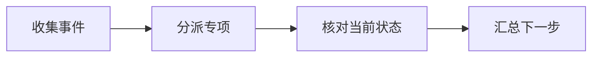

## 场景与成果

行业排障既需要团队积累的经验，也需要事件发生时的真实资源状态。数字分身把协作入口、专项知识和诊断工具连接起来，帮助用户组织一次完整排查。

通过常驻协作入口路由行业排障任务，将知识检索、专业 Skill 和云资源诊断连接起来。

本文根据俊行提供的 showcase 资料整理。流程图与分工表用于解释案例中的方法；后面的具体示例是复用建议，不作为生产运行的实测结论。

## 实现思路

### 一次任务如何流经产品

原案例描述由主 Agent 分派多个专项 Agent。知识检索给出排查方向，实时资源工具补充当前状态，汇总时需要区分两类证据。



每个环节都需要把自己的输入与结果交给下一步。后续步骤据此继续工作，用户也能沿着这条链查看结果从哪里产生、在哪一步需要确认。

### 角色分工与权威事实

| 组成部分 | 在案例中的职责 |
|---|---|
| 主 Agent | 保留事件上下文与任务路由 |
| 专项 Agent | 知识检索与专业诊断 |
| 工具层 | 当前资源事实和调用状态 |

并行会诊的前提是共享事件上下文。增加 Agent 数量不能弥补资源标识、时间窗口或错误信息不完整；先统一证据格式，再并行查询。

### 沿着一个具体任务展开

围绕一台测试云主机的连接超时，组织知识检索、资源状态检查和事件时间线，返回有证据的排障建议。

1. **收集事件**：记录资源标识、错误现象、开始时间和影响范围；缺少关键信息时先补问。
2. **分派专项**：将网络、资源配置和历史知识查询拆开，各角色共享同一事件范围。
3. **核对当前状态**：只读工具返回带时间戳的配置与状态，区分实时观察和历史文档建议。
4. **汇总下一步**：对候选原因排序，列出支持证据和缺失证据，修复操作另行授权。

这条流程的交付物需要保留过程中使用的依据。某一步缺少数据或执行失败时，应让状态继续可见，避免后续环节把它当作已经完成的结果。

### 让结果可以被核对

下面用一组合成数据说明预期交付。它是应用侧的说明样例，不是 QCA API 请求，也不是生产记录。

```json
{
  "input": {
    "network_check": "timeout",
    "configuration_check": "unavailable"
  },
  "expected": {
    "observation": "connection timeout",
    "root_cause": "undetermined",
    "missing": [
      "configuration evidence"
    ]
  }
}
```

“观察到超时”与“已找到根因”是不同的完成状态。缺少配置证据时，合格报告应提出下一项检查，而不是生成确定结论。

## 复用建议

落地时可以先复现上面的一个任务，用已知输入核对交付结果，再补齐下面这些失败或歧义场景。通过后再扩大任务范围。

| 失败或歧义场景 | 需要保留的行为 |
|---|---|
| 一个专项工具失败 | 保留已获得证据，明确缺失检查。 |
| 多个角色给出矛盾结论 | 回到时间和资源标识核对。 |
| 历史案例与现象相似 | 作为候选解释，不直接判定根因。 |