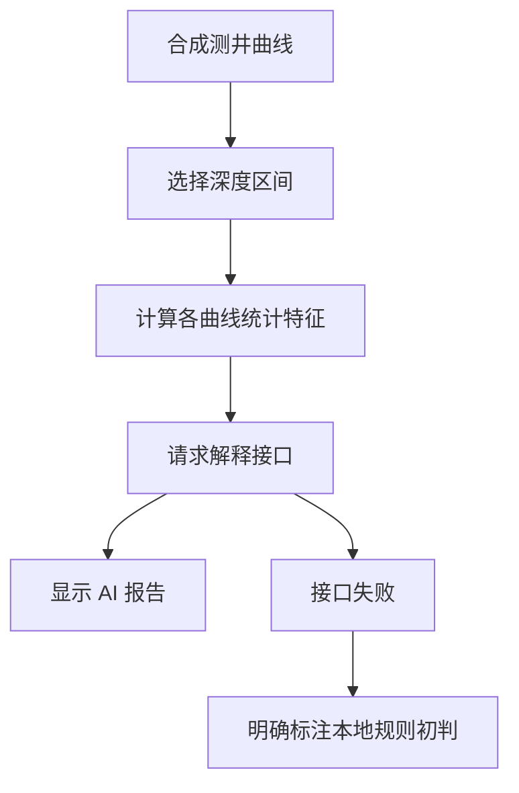

## 场景与成果

[打开在线演示：测井智能解释工作台](https://hao2-welllog-ai.vercel.app)

测井解释需要把不同曲线放在同一深度坐标下阅读，再判断某个井段呈现什么特征。何傲的这个行业智能案例把曲线选择、数值特征和 AI 报告放在同一个界面，使用户可以围绕具体井段提出解释任务。


*图片来自 showcase 中的演示截图，原案例作者：何傲。页面使用合成演示井数据。*

### 三分钟体验

1. 打开演示井 X-1，查看 GR、SP、RT、AC、DEN、POR、SW 等曲线。
2. 在曲线区域拖动选择井段，或输入顶深与底深；滚轮缩放，双击复位。
3. 点击“AI 智能解释”，将报告与选中井段的曲线和特征数值对照阅读。

本次实际提交了 **2040–2075 m** 井段，页面成功返回 AI 解释报告，包含岩性、物性、流体判断和建议等内容。这里验证的是选段到报告的交互闭环，没有验证地质结论的正确性。

演示井范围为 2000–2400 m，采样间隔为 0.5 m。公开前端通过固定随机种子、分层基线和噪声生成曲线，因此这是一份可重复体验的合成数据案例，不是真实油田生产数据。

## 实现思路

### 先算数值，再请求解释

公开前端会筛选所选深度区间内的采样点，对各条曲线计算均值、最小值和最大值，再将井段和特征发送到同站点的 `/api/interpret`。页面提交的主要字段是 `depthRange` 和 `features`。



这种设计让确定性代码负责计算，让模型基于明确的数值上下文组织解释。前端能确认上述请求结构，但未公开可核对的后端 Agent 配置或 QCA 调用轨迹，不能把它进一步描述为已验证的多 Agent 工作流。

### 把失败状态展示清楚

| 环节 | 公开前端的处理 | 对使用者的价值 |
|---|---|---|
| 区间检查 | 顶深必须小于底深，且在演示范围内 | 避免无效请求 |
| 请求中 | 显示加载状态并暂时禁用提交按钮 | 防止重复点击 |
| 请求成功 | 展示服务端返回的解释文本 | 围绕当前选段阅读报告 |
| 请求失败 | 显示服务不可用与“本地规则初判（离线兜底）” | 区分模型回答与规则结果 |

成功路径经过实际体验；离线兜底来自公开前端代码核对，本次没有主动制造服务故障。清楚标注两种结果来源很重要，否则读者可能把规则模板误认为模型已经完成了解释。

### 让报告始终能回到证据

案例保留了曲线与解释的并排呈现，用户可以回看所选区间，而不必凭报告文字想象原始数据。不过，均值、最小值和最大值会压缩层间变化：包含薄层或多个地层的区间，可能需要进一步细分后再解释。

## 复用建议

复用到其他行业数据分析时，可以保留这套基本交互：先选定数据范围，再展示确定性特征，最后请求解释。报告应绑定本次井段、数据版本和请求标识，避免用户更改选段后把旧报告误当成新结果。

进一步做测井评测，应让领域专家为合成或获授权的数据建立参考结论，覆盖跨层区间、缺失曲线、异常值和接口失败。分别检查数值计算、证据引用及解释质量，不能仅凭“生成了一份完整报告”判定任务成功。

涉及射孔、试油等作业决策的报告需要专业人员复核。这个公开案例最有价值的地方，是把模型嵌入一个可选段、可回看曲线、可区分失败来源的行业界面，而不只是提供一个通用聊天框。

### 实践演练：从任务到验收

分别解释一个单层井段与一个跨层井段，比较统计特征的压缩是否掩盖曲线变化。

以下是可复用的实现与验收建议，不代表演示站已公开这些后端能力，也不表示这些检查已经执行通过。演练使用合成或获授权输入；JSON 是应用侧记录示意，不是 QCA API 请求。

### 分步实现与交付物

#### 1. 选择井段

固定合成数据版本，记录两个区间及选择原因。

#### 2. 核对特征

复算均值、最小值和最大值，确认输入接口的数值。

#### 3. 请求解释

逐次提交并保留报告与区间关联，避免旧报告被当作当前结果。

#### 4. 领域复核

检查报告是否引用实际数值，区分观察与推断。

### 输入输出记录示例

```json
{
  "data": "synthetic-X-1",
  "intervals": [
    [
      2040,
      2075
    ],
    [
      2030,
      2090
    ]
  ],
  "review": "evidence-grounding"
}
```

将这份记录与产物或报告一起保存，用来回答“这份结果来自哪个输入、哪个版本”。凭证不写入记录。输入变化后应重新判断旧结果是否适用，不能静默复用。

### 故障与验收检查

| 检查条件 | 预期结果 |
|---|---|
| 快速切换区间 | 旧响应不覆盖新选择。 |
| 跨层均值相近 | 报告应说明汇总局限。 |
| 接口失败 | 清晰显示规则兜底身份。 |

为每个检查准备可重复输入，记录实际观察。验收时对照产物、状态或数值，不只阅读一段看似合理的解释；尚未验证的项目保留为待验收，不能按通过统计。

### 关键取舍

数值正确不等于地质解释正确，需要分别评估聚合计算、引用一致性和专业结论。
